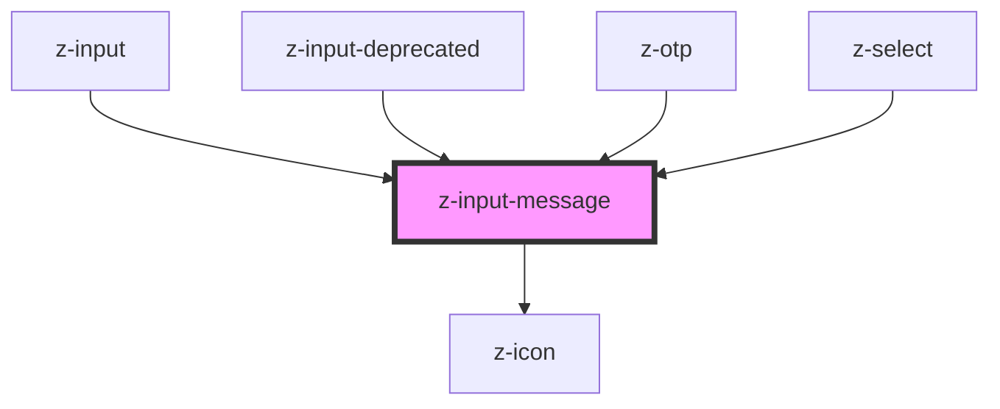

# z-input-message

<!-- Auto Generated Below -->

## Properties

| Property  | Attribute | Description             | Type                                                                          | Default     |
| --------- | --------- | ----------------------- | ----------------------------------------------------------------------------- | ----------- |
| `message` | `message` | input helper message    | `string`                                                                      | `undefined` |
| `status`  | `status`  | input status (optional) | `InputStatusEnum.ERROR \| InputStatusEnum.SUCCESS \| InputStatusEnum.WARNING` | `undefined` |

## Dependencies

### Used by

- [z-input](../z-input)
- [z-input-deprecated](../../../deprecated/z-input-deprecated)
- [z-otp](../../../snowflakes/myz/z-otp)
- [z-select](../z-select)

### Depends on

- [z-icon](../../icons/z-icon)

### Graph

---

_Built with [StencilJS](https://stenciljs.com/)_
