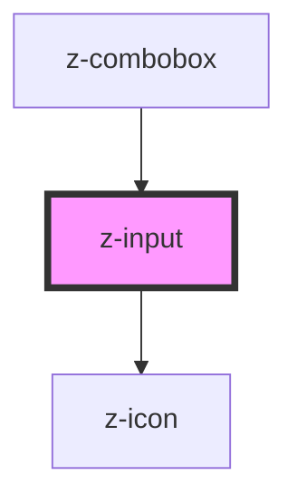

# z-input

<!-- readme-group="input" -->

```html
<!-- type text -->
<z-input label="default" placeholder="Cerca Autore"></z-input>
<z-input label="filled" value="testo testo testo"></z-input>
<z-input
  label="disabled"
  placeholder="placeholder"
  disabled
  value="i'm disabled"
></z-input>
<z-input
  label="readonly"
  placeholder="placeholder"
  readonly
  value="i'm read-only"
></z-input>
<z-input
  label="success"
  placeholder="placeholder"
  status="success"
  message="message message"
  value=""
></z-input>
<z-input
  label="error"
  placeholder="placeholder"
  status="error"
  message="message message"
  value="testo"
></z-input>
<z-input
  label="warning"
  placeholder="placeholder"
  status="warning"
  message="message message message message message message message message message message message message message message message message message message"
></z-input>
<z-input
  label="message"
  placeholder="placeholder"
  message="helper message"
></z-input>

<!-- type textarea -->
<z-input type="textarea"></z-input>
<z-input type="textarea" label="default" placeholder="Cerca Autore"></z-input>
<z-input type="textarea" label="filled" value="testo testo testo"></z-input>
<z-input
  type="textarea"
  label="disabled"
  placeholder="placeholder"
  disabled
  value="i'm disabled"
></z-input>
<z-input
  type="textarea"
  label="readonly"
  placeholder="placeholder"
  readonly
  value="i'm read-only"
></z-input>
<z-input
  type="textarea"
  label="success"
  placeholder="placeholder"
  status="success"
  message="message message"
  value=""
></z-input>
<z-input
  type="textarea"
  label="error"
  placeholder="placeholder"
  status="error"
  message="message message"
  value="testo"
></z-input>
<z-input
  type="textarea"
  label="warning"
  placeholder="placeholder"
  status="warning"
  message="message message"
></z-input>
<z-input
  type="textarea"
  label="message"
  placeholder="placeholder"
  message="helper message"
></z-input>

<!-- type checkbox -->
<z-input type="checkbox" htmlid="check1"></z-input>
<z-input
  type="checkbox"
  htmlid="check2"
  label="this is a checkbox"
  checked="true"
></z-input>
<z-input
  type="checkbox"
  htmlid="check4"
  value="value"
  disabled="true"
  label="disabled"
  labelafter="false"
></z-input>
<z-input
  type="checkbox"
  htmlid="check5"
  value="value"
  readonly="true"
  label="read-only"
></z-input>
```

<!-- Auto Generated Below -->


## Properties

| Property        | Attribute       | Description                                                                                         | Type                                                                                                                                                                                             | Default      |
| --------------- | --------------- | --------------------------------------------------------------------------------------------------- | ------------------------------------------------------------------------------------------------------------------------------------------------------------------------------------------------ | ------------ |
| `checked`       | `checked`       | checked: available for checkbox, radio                                                              | `boolean`                                                                                                                                                                                        | `false`      |
| `disabled`      | `disabled`      | the input is disabled                                                                               | `boolean`                                                                                                                                                                                        | `false`      |
| `hasmessage`    | `hasmessage`    | show input helper message (optional): available for text, password, number, email, textarea, select | `boolean`                                                                                                                                                                                        | `true`       |
| `htmlid`        | `htmlid`        | the id of the input element                                                                         | `string`                                                                                                                                                                                         | `randomId()` |
| `htmltitle`     | `htmltitle`     | the input html title (optional)                                                                     | `string`                                                                                                                                                                                         | `undefined`  |
| `items`         | `items`         | items: available for select                                                                         | `SelectItemBean[] \| string`                                                                                                                                                                     | `undefined`  |
| `label`         | `label`         | the input label                                                                                     | `string`                                                                                                                                                                                         | `undefined`  |
| `labelafter`    | `labelafter`    | the input label position: available for checkbox, radio                                             | `boolean`                                                                                                                                                                                        | `true`       |
| `message`       | `message`       | input helper message (optional): available for text, password, number, email, textarea, select      | `string`                                                                                                                                                                                         | `undefined`  |
| `name`          | `name`          | the input name                                                                                      | `string`                                                                                                                                                                                         | `undefined`  |
| `placeholder`   | `placeholder`   | the input placeholder (optional)                                                                    | `string`                                                                                                                                                                                         | `undefined`  |
| `readonly`      | `readonly`      | the input is readonly                                                                               | `boolean`                                                                                                                                                                                        | `false`      |
| `status`        | `status`        | the input status (optional): available for text, password, number, email, textarea, select          | `InputStatusEnum.error \| InputStatusEnum.success \| InputStatusEnum.warning`                                                                                                                    | `undefined`  |
| `type`          | `type`          | input types                                                                                         | `InputTypeEnum.checkbox \| InputTypeEnum.email \| InputTypeEnum.number \| InputTypeEnum.password \| InputTypeEnum.radio \| InputTypeEnum.select \| InputTypeEnum.text \| InputTypeEnum.textarea` | `undefined`  |
| `typingtimeout` | `typingtimeout` | timeout setting before trigger `inputChange` event (optional): available for text, textarea         | `number`                                                                                                                                                                                         | `300`        |
| `value`         | `value`         | the input value                                                                                     | `string`                                                                                                                                                                                         | `undefined`  |


## Events

| Event          | Description                                                               | Type               |
| -------------- | ------------------------------------------------------------------------- | ------------------ |
| `inputChange`  | Emitted on input value change, returns value, keycode                     | `CustomEvent<any>` |
| `inputCheck`   | Emitted on checkbox check/uncheck, returns id, checked, type, name        | `CustomEvent<any>` |
| `optionSelect` | Emitted on select option selection, returns select id, selected option id | `CustomEvent<any>` |
| `startTyping`  | Emitted when user starts typing                                           | `CustomEvent<any>` |
| `stopTyping`   | Emitted when user stops typing, returns value                             | `CustomEvent<any>` |


## Methods

### `getValue() => Promise<string>`

get the input value

#### Returns

Type: `Promise<string>`


### `isChecked() => Promise<boolean>`

get checked status

#### Returns

Type: `Promise<boolean>`


### `setValue(value: string) => Promise<void>`

set the input value

#### Returns

Type: `Promise<void>`


## Dependencies

### Used by

 - [z-combobox](../z-combobox)

### Depends on

- [z-icon](../../icons/z-icon)

### Graph


----------------------------------------------

*Built with [StencilJS](https://stenciljs.com/)*
