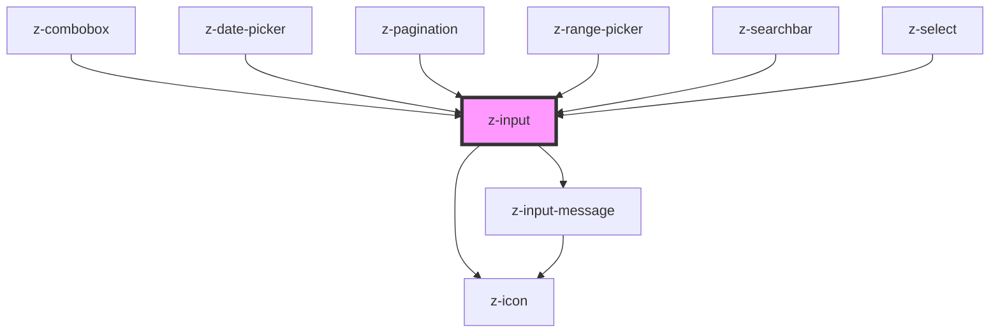

# z-input

<!-- readme-group="input" -->

```html
<!-- type text -->
<z-input
  label="default"
  placeholder="Cerca Autore"
></z-input>
<z-input
  label="filled"
  value="testo testo testo"
></z-input>
<z-input
  label="disabled"
  placeholder="placeholder"
  disabled
  value="i'm disabled"
></z-input>
<z-input
  label="readonly"
  placeholder="placeholder"
  readonly
  value="i'm read-only"
></z-input>
<z-input
  label="success"
  placeholder="placeholder"
  status="success"
  message="message message"
  value=""
></z-input>
<z-input
  label="error"
  placeholder="placeholder"
  status="error"
  message="message message"
  value="testo"
></z-input>
<z-input
  label="warning"
  placeholder="placeholder"
  status="warning"
  message="message message message message message message message message message message message message message message message message message message"
></z-input>
<z-input
  label="message"
  placeholder="placeholder"
  message="helper message"
></z-input>

<!-- type textarea -->
<z-input type="textarea"></z-input>
<z-input
  type="textarea"
  label="default"
  placeholder="Cerca Autore"
></z-input>
<z-input
  type="textarea"
  label="filled"
  value="testo testo testo"
></z-input>
<z-input
  type="textarea"
  label="disabled"
  placeholder="placeholder"
  disabled
  value="i'm disabled"
></z-input>
<z-input
  type="textarea"
  label="readonly"
  placeholder="placeholder"
  readonly
  value="i'm read-only"
></z-input>
<z-input
  type="textarea"
  label="success"
  placeholder="placeholder"
  status="success"
  message="message message"
  value=""
></z-input>
<z-input
  type="textarea"
  label="error"
  placeholder="placeholder"
  status="error"
  message="message message"
  value="testo"
></z-input>
<z-input
  type="textarea"
  label="warning"
  placeholder="placeholder"
  status="warning"
  message="message message"
></z-input>
<z-input
  type="textarea"
  label="message"
  placeholder="placeholder"
  message="helper message"
></z-input>

<!-- type checkbox -->
<z-input
  type="checkbox"
  htmlid="check1"
></z-input>
<z-input
  type="checkbox"
  htmlid="check2"
  label="this is a checkbox"
  checked="true"
></z-input>
<z-input
  type="checkbox"
  htmlid="check4"
  value="value"
  disabled="true"
  label="disabled"
  labelafter="false"
></z-input>
<z-input
  type="checkbox"
  htmlid="check5"
  value="value"
  readonly="true"
  label="read-only"
></z-input>
```

<!-- Auto Generated Below -->


## Properties

| Property               | Attribute               | Description                                                                                                                           | Type                                                                                                                                                                                               | Default               |
| ---------------------- | ----------------------- | ------------------------------------------------------------------------------------------------------------------------------------- | -------------------------------------------------------------------------------------------------------------------------------------------------------------------------------------------------- | --------------------- |
| `ariaActivedescendant` | `aria-activedescendant` | the input aria-activedescendant (optional): available for text, password, number, email                                               | `string`                                                                                                                                                                                           | `undefined`           |
| `ariaAutocomplete`     | `aria-autocomplete`     | the input aria-autocomplete (optional): available for text, password, number, email                                                   | `string`                                                                                                                                                                                           | `undefined`           |
| `ariaControls`         | `aria-controls`         | the input aria-controls (optional): available for text, password, number, email                                                       | `string`                                                                                                                                                                                           | `undefined`           |
| `ariaExpanded`         | `aria-expanded`         | the input aria-expaded: available for text, password, number, email                                                                   | `string`                                                                                                                                                                                           | `""`                  |
| `ariaLabel`            | `aria-label`            | the input aria-label                                                                                                                  | `string`                                                                                                                                                                                           | `""`                  |
| `autocomplete`         | `autocomplete`          | the input has autocomplete option (optional): available for text, password, number, email                                             | `string`                                                                                                                                                                                           | `undefined`           |
| `checked`              | `checked`               | checked: available for checkbox, radio                                                                                                | `boolean`                                                                                                                                                                                          | `false`               |
| `disabled`             | `disabled`              | the input is disabled                                                                                                                 | `boolean`                                                                                                                                                                                          | `false`               |
| `hasclearicon`         | `hasclearicon`          | render clear icon when typing (optional): available for text                                                                          | `boolean`                                                                                                                                                                                          | `true`                |
| `htmlid`               | `htmlid`                | the id of the input element                                                                                                           | `string`                                                                                                                                                                                           | ``id-${randomId()}``  |
| `htmltitle`            | `htmltitle`             | the input html title (optional)                                                                                                       | `string`                                                                                                                                                                                           | `undefined`           |
| `icon`                 | `icon`                  | render icon (optional): available for text                                                                                            | `string`                                                                                                                                                                                           | `undefined`           |
| `label`                | `label`                 | the input label                                                                                                                       | `string`                                                                                                                                                                                           | `undefined`           |
| `labelPosition`        | `label-position`        | the input label position: available for checkbox, radio                                                                               | `LabelPosition.LEFT \| LabelPosition.RIGHT`                                                                                                                                                        | `LabelPosition.RIGHT` |
| `max`                  | `max`                   | max number value (optional): available for number                                                                                     | `number`                                                                                                                                                                                           | `undefined`           |
| `maxlength`            | `maxlength`             | Max length value (optional): available for text                                                                                       | `number`                                                                                                                                                                                           | `undefined`           |
| `message`              | `message`               | input helper message (optional): available for text, password, number, email, textarea - if set to `false` message won't be displayed | `boolean \| string`                                                                                                                                                                                | `true`                |
| `min`                  | `min`                   | min number value (optional): available for number                                                                                     | `number`                                                                                                                                                                                           | `undefined`           |
| `minlength`            | `minlength`             | Min length value (optional): available for text                                                                                       | `number`                                                                                                                                                                                           | `undefined`           |
| `name`                 | `name`                  | the input name                                                                                                                        | `string`                                                                                                                                                                                           | `undefined`           |
| `pattern`              | `pattern`               | pattern value (optional): available for tel, text, search, url, email, password                                                       | `string`                                                                                                                                                                                           | `undefined`           |
| `placeholder`          | `placeholder`           | the input placeholder (optional)                                                                                                      | `string`                                                                                                                                                                                           | `undefined`           |
| `readonly`             | `readonly`              | the input is readonly                                                                                                                 | `boolean`                                                                                                                                                                                          | `false`               |
| `required`             | `required`              | the input is required (optional): available for text, password, number, email, textarea, checkbox                                     | `boolean`                                                                                                                                                                                          | `false`               |
| `role`                 | `role`                  | the input role                                                                                                                        | `string`                                                                                                                                                                                           | `""`                  |
| `size`                 | `size`                  | Available sizes: `big`, `small` and `x-small`. Defaults to `big`.                                                                     | `ControlSize.BIG \| ControlSize.SMALL \| ControlSize.X_SMALL`                                                                                                                                      | `ControlSize.BIG`     |
| `status`               | `status`                | the input status (optional): available for text, password, number, email, textarea                                                    | `InputStatus.ERROR \| InputStatus.SUCCESS \| InputStatus.WARNING`                                                                                                                                  | `undefined`           |
| `step`                 | `step`                  | step number value (optional): available for number                                                                                    | `number`                                                                                                                                                                                           | `undefined`           |
| `type`                 | `type`                  | input types                                                                                                                           | `InputType.CHECKBOX \| InputType.EMAIL \| InputType.NUMBER \| InputType.PASSWORD \| InputType.RADIO \| InputType.SEARCH \| InputType.TEL \| InputType.TEXT \| InputType.TEXTAREA \| InputType.URL` | `undefined`           |
| `value`                | `value`                 | the input value                                                                                                                       | `string`                                                                                                                                                                                           | `undefined`           |


## Events

| Event         | Description                                                                         | Type               |
| ------------- | ----------------------------------------------------------------------------------- | ------------------ |
| `inputBlur`   | Emitted on input blur                                                               | `CustomEvent<any>` |
| `inputChange` | Emitted on input value change, returns value, validity                              | `CustomEvent<any>` |
| `inputCheck`  | Emitted on checkbox check/uncheck, returns id, checked, type, name, value, validity | `CustomEvent<any>` |
| `inputFocus`  | Emitted on input focus                                                              | `CustomEvent<any>` |
| `startTyping` | Emitted when user starts typing                                                     | `CustomEvent<any>` |
| `stopTyping`  | Emitted when user stops typing, returns value, validity                             | `CustomEvent<any>` |


## Methods

### `isChecked() => Promise<boolean>`

get checked status

#### Returns

Type: `Promise<boolean>`


## Dependencies

### Used by

 - [z-combobox](../z-combobox)
 - [z-date-picker](../../date-picker/z-date-picker)
 - [z-pagination](../../z-pagination)
 - [z-range-picker](../../date-picker/z-range-picker)
 - [z-searchbar](../z-searchbar)
 - [z-select](../z-select)

### Depends on

- [z-icon](../../icons/z-icon)
- [z-input-message](../z-input-message)

### Graph


----------------------------------------------

*Built with [StencilJS](https://stenciljs.com/)*
