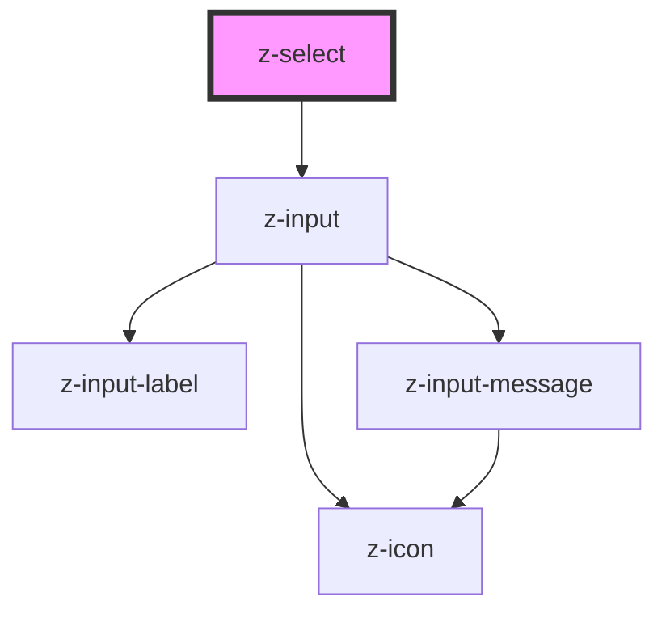

# z-select

<!-- Auto Generated Below -->

## Properties

| Property       | Attribute      | Description                                                                                         | Type                                                                                                       | Default      |
| -------------- | -------------- | --------------------------------------------------------------------------------------------------- | ---------------------------------------------------------------------------------------------------------- | ------------ |
| `autocomplete` | `autocomplete` |                                                                                                     | `boolean`                                                                                                  | `false`      |
| `disabled`     | `disabled`     | the input is disabled                                                                               | `boolean`                                                                                                  | `false`      |
| `hasmessage`   | `hasmessage`   | show input helper message (optional): available for text, password, number, email, textarea, select | `boolean`                                                                                                  | `true`       |
| `htmlid`       | `htmlid`       | the id of the input element                                                                         | `string`                                                                                                   | `randomId()` |
| `htmltitle`    | `htmltitle`    | the input html title (optional)                                                                     | `string`                                                                                                   | `undefined`  |
| `items`        | `items`        | items: available for select                                                                         | `SelectItemBean[] \| string`                                                                               | `undefined`  |
| `label`        | `label`        | the input label                                                                                     | `string`                                                                                                   | `undefined`  |
| `message`      | `message`      | input helper message (optional): available for text, password, number, email, textarea, select      | `string`                                                                                                   | `undefined`  |
| `name`         | `name`         | the input name                                                                                      | `string`                                                                                                   | `undefined`  |
| `placeholder`  | `placeholder`  | the input placeholder (optional)                                                                    | `string`                                                                                                   | `undefined`  |
| `readonly`     | `readonly`     | the input is readonly                                                                               | `boolean`                                                                                                  | `false`      |
| `status`       | `status`       | the input status (optional): available for text, password, number, email, textarea, select          | `InputStatusEnum.error \| InputStatusEnum.selecting \| InputStatusEnum.success \| InputStatusEnum.warning` | `undefined`  |

## Events

| Event          | Description                                                               | Type               |
| -------------- | ------------------------------------------------------------------------- | ------------------ |
| `optionSelect` | Emitted on select option selection, returns select id, selected option id | `CustomEvent<any>` |

## Methods

### `getValue() => Promise<string>`

get the input value

#### Returns

Type: `Promise<string>`

## Dependencies

### Depends on

- [z-input](../z-input)

### Graph

----------------------------------------------

*Built with [StencilJS](https://stenciljs.com/)*
