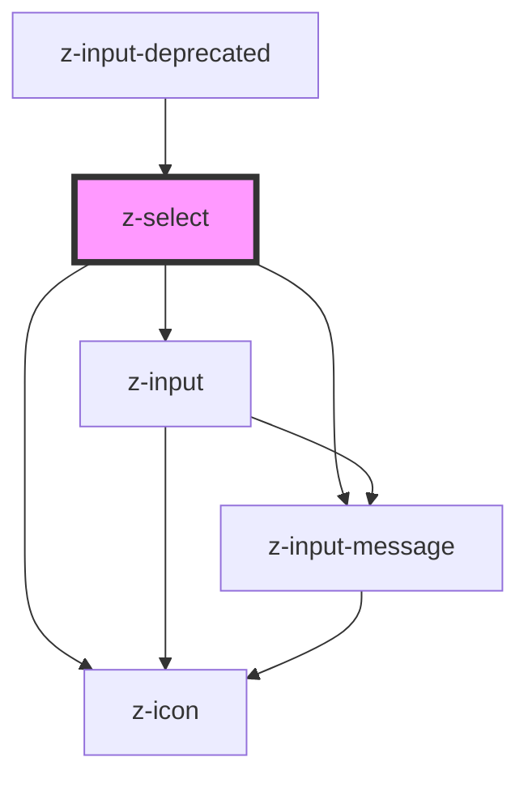

# z-select

<!-- Auto Generated Below -->

## Properties

| Property         | Attribute        | Description                                                                                    | Type                                | Default              |
| ---------------- | ---------------- | ---------------------------------------------------------------------------------------------- | ----------------------------------- | -------------------- |
| `ariaLabel`      | `aria-label`     | the input aria-label                                                                           | `string`                            | `undefined`          |
| `autocomplete`   | `autocomplete`   | the input has autocomplete option                                                              | `boolean`                           | `false`              |
| `disabled`       | `disabled`       | the input is disabled                                                                          | `boolean`                           | `false`              |
| `htmlid`         | `htmlid`         | the id of the input element                                                                    | `string`                            | ``id-${randomId()}`` |
| `htmltitle`      | `htmltitle`      | the input html title (optional)                                                                | `string`                            | `undefined`          |
| `items`          | `items`          | the input select options                                                                       | `SelectItemBean[] \| string`        | `undefined`          |
| `label`          | `label`          | the input label                                                                                | `string`                            | `undefined`          |
| `message`        | `message`        | input helper message (optional): available for text, password, number, email, textarea, select | `boolean \| string`                 | `true`               |
| `name`           | `name`           | the input name                                                                                 | `string`                            | `undefined`          |
| `noresultslabel` | `noresultslabel` | no result text message                                                                         | `string`                            | `"Nessun risultato"` |
| `placeholder`    | `placeholder`    | the input placeholder (optional)                                                               | `string`                            | `undefined`          |
| `readonly`       | `readonly`       | the input is readonly                                                                          | `boolean`                           | `false`              |
| `status`         | `status`         | the input status (optional): available for text, password, number, email, textarea, select     | `"error" \| "success" \| "warning"` | `undefined`          |

## Events

| Event          | Description                                                             | Type               |
| -------------- | ----------------------------------------------------------------------- | ------------------ |
| `optionSelect` | Emitted on select option selection, returns select id, selected item id | `CustomEvent<any>` |

## Methods

### `getSelectedItem() => Promise<SelectItemBean>`

get the input selected options

#### Returns

Type: `Promise<SelectItemBean>`

### `getValue() => Promise<string>`

get the input value

#### Returns

Type: `Promise<string>`

### `setValue(value: string | string[]) => Promise<void>`

set the input value

#### Returns

Type: `Promise<void>`

## Dependencies

### Used by

 - [z-input-deprecated](../../../deprecated/z-input-deprecated)

### Depends on

- [z-input](../z-input)
- [z-icon](../../icons/z-icon)
- [z-input-message](../z-input-message)

### Graph

----------------------------------------------

*Built with [StencilJS](https://stenciljs.com/)*
