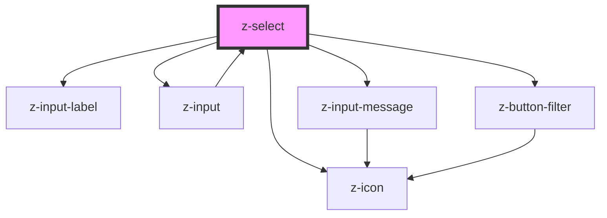

# z-select

<!-- Auto Generated Below -->

## Properties

| Property         | Attribute        | Description                                                                                         | Type                                                                                                       | Default              |
| ---------------- | ---------------- | --------------------------------------------------------------------------------------------------- | ---------------------------------------------------------------------------------------------------------- | -------------------- |
| `autocomplete`   | `autocomplete`   | the input has autocomplete option                                                                   | `boolean`                                                                                                  | `false`              |
| `disabled`       | `disabled`       | the input is disabled                                                                               | `boolean`                                                                                                  | `false`              |
| `hasmessage`     | `hasmessage`     | show input helper message (optional): available for text, password, number, email, textarea, select | `boolean`                                                                                                  | `true`               |
| `htmlid`         | `htmlid`         | the id of the input element                                                                         | `string`                                                                                                   | `randomId()`         |
| `htmltitle`      | `htmltitle`      | the input html title (optional)                                                                     | `string`                                                                                                   | `undefined`          |
| `items`          | `items`          | the input select options                                                                            | `SelectItemBean[] \| string`                                                                               | `undefined`          |
| `label`          | `label`          | the input label                                                                                     | `string`                                                                                                   | `undefined`          |
| `message`        | `message`        | input helper message (optional): available for text, password, number, email, textarea, select      | `string`                                                                                                   | `undefined`          |
| `multiple`       | `multiple`       | multiple options can be selected                                                                    | `boolean`                                                                                                  | `false`              |
| `name`           | `name`           | the input name                                                                                      | `string`                                                                                                   | `undefined`          |
| `noresultslabel` | `noresultslabel` | no result text message                                                                              | `string`                                                                                                   | `"Nessun risultato"` |
| `placeholder`    | `placeholder`    | the input placeholder (optional)                                                                    | `string`                                                                                                   | `undefined`          |
| `readonly`       | `readonly`       | the input is readonly                                                                               | `boolean`                                                                                                  | `false`              |
| `status`         | `status`         | the input status (optional): available for text, password, number, email, textarea, select          | `InputStatusEnum.error \| InputStatusEnum.selecting \| InputStatusEnum.success \| InputStatusEnum.warning` | `undefined`          |

## Events

| Event                | Description                                                                                                          | Type               |
| -------------------- | -------------------------------------------------------------------------------------------------------------------- | ------------------ |
| `autocompleteResult` | Emitted on stopTyping, returns autocomplete result array, search string, exact match                                 | `CustomEvent<any>` |
| `optionSelect`       | Emitted on select option selection, returns select id, selected item id (or array of selected items ids if multiple) | `CustomEvent<any>` |

## Methods

### `getSelectedItems() => Promise<SelectItemBean[]>`

get the input selected options

#### Returns

Type: `Promise<SelectItemBean[]>`

### `getValue() => Promise<string | string[]>`

get the input value

#### Returns

Type: `Promise<string | string[]>`

### `setSearchString(value: string) => Promise<void>`

set search string value

#### Returns

Type: `Promise<void>`

### `setValue(value: string | string[]) => Promise<void>`

set the input value

#### Returns

Type: `Promise<void>`

## Dependencies

### Used by

 - [z-input](../z-input)

### Depends on

- [z-input-label](../z-input-label)
- [z-input](../z-input)
- [z-button-filter](../../buttons/z-button-filter)
- [z-icon](../../icons/z-icon)
- [z-input-message](../z-input-message)

### Graph

----------------------------------------------

*Built with [StencilJS](https://stenciljs.com/)*
