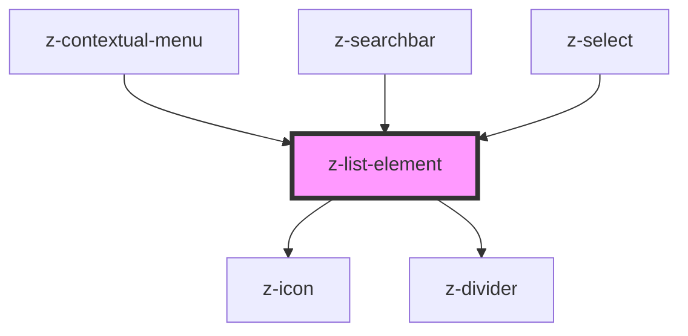

# z-list-element

<!-- Auto Generated Below -->

## Properties

| Property              | Attribute               | Description                                                          | Type                                                                        | Default                          |
| --------------------- | ----------------------- | -------------------------------------------------------------------- | --------------------------------------------------------------------------- | -------------------------------- |
| `alignButton`         | `align-button`          | [optional] Align expandable button left or right.                    | `ExpandableListButtonAlign.LEFT \| ExpandableListButtonAlign.RIGHT`         | `ExpandableListButtonAlign.LEFT` |
| `clickable`           | `clickable`             | [optional] Sets element clickable.                                   | `boolean`                                                                   | `false`                          |
| `color`               | `color`                 | [optional] Sets text color of the element.                           | `string`                                                                    | `"none"`                         |
| `disabled`            | `disabled`              | [optional] Sets disabled style of the element.                       | `boolean`                                                                   | `false`                          |
| `dividerColor`        | `divider-color`         | [optional] Sets the divider color.                                   | `string`                                                                    | `"color-surface03"`              |
| `dividerSize`         | `divider-size`          | [optional] Sets the divider size.                                    | `DividerSize.LARGE \| DividerSize.MEDIUM \| DividerSize.SMALL`              | `DividerSize.SMALL`              |
| `dividerType`         | `divider-type`          | [optional] Sets the position where to insert the divider.            | `ListDividerType.ELEMENT \| ListDividerType.HEADER \| ListDividerType.NONE` | `ListDividerType.NONE`           |
| `expandable`          | `expandable`            | [optional] Sets element as expandable.                               | `boolean`                                                                   | `false`                          |
| `expandableStyle`     | `expandable-style`      | [optional] Sets expandable style to element.                         | `ExpandableListStyle.ACCORDION \| ExpandableListStyle.MENU`                 | `ExpandableListStyle.ACCORDION`  |
| `isContextualMenu`    | `is-contextual-menu`    | [optional] If is used in ZContextualMenu component                   | `boolean`                                                                   | `false`                          |
| `listElementId`       | `list-element-id`       | [optional] List element id.                                          | `number`                                                                    | `undefined`                      |
| `listElementPosition` | `list-element-position` | [optional] position of the list element inside the list or the group | `string`                                                                    | `"0"`                            |
| `listType`            | `list-type`             | [optional] type of the list marker for each element                  | `ListType.NONE \| ListType.ORDERED \| ListType.UNORDERED`                   | `ListType.NONE`                  |
| `size`                | `size`                  | [optional] Sets size of inside elements.                             | `ListSize.LARGE \| ListSize.MEDIUM \| ListSize.SMALL \| ListSize.X_LARGE`   | `ListSize.MEDIUM`                |

## Events

| Event             | Description                                 | Type                  |
| ----------------- | ------------------------------------------- | --------------------- |
| `accessibleFocus` | remove filter click event, returns filterid | `CustomEvent<number>` |
| `clickItem`       | remove filter click event, returns filterid | `CustomEvent<any>`    |

## Dependencies

### Used by

 - [z-contextual-menu](../../z-contextual-menu)
 - [z-searchbar](../../inputs/z-searchbar)
 - [z-select](../../inputs/z-select)

### Depends on

- [z-icon](../../icons/z-icon)
- [z-divider](../../z-divider)

### Graph

----------------------------------------------

*Built with [StencilJS](https://stenciljs.com/)*
