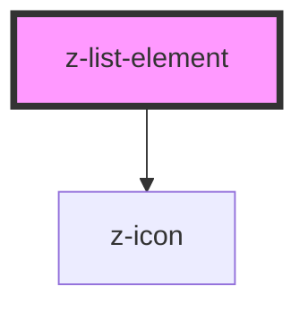

# z-list-element

<!-- Auto Generated Below -->

## Properties

| Property          | Attribute          | Description                                       | Type                                                                | Default                          |
| ----------------- | ------------------ | ------------------------------------------------- | ------------------------------------------------------------------- | -------------------------------- |
| `alignButton`     | `align-button`     | [optional] Align expandable button left or right. | `ExpandableListButtonAlign.left \| ExpandableListButtonAlign.right` | `ExpandableListButtonAlign.left` |
| `clickable`       | `clickable`        | [optional] Sets element clickable.                | `boolean`                                                           | `false`                          |
| `expandable`      | `expandable`       | [optional] Sets element as expandable.            | `boolean`                                                           | `false`                          |
| `expandableStyle` | `expandable-style` | [optional] Sets expandable style to element.      | `ExpandableListStyle.accordion \| ExpandableListStyle.menu`         | `ExpandableListStyle.accordion`  |

## Dependencies

### Depends on

- [z-icon](../../icons/z-icon)

### Graph

----------------------------------------------

*Built with [StencilJS](https://stenciljs.com/)*
