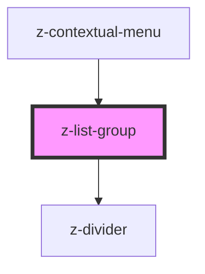

# z-list-group

<!-- Auto Generated Below -->

## Properties

| Property       | Attribute       | Description                                               | Type                                                                                  | Default                |
| -------------- | --------------- | --------------------------------------------------------- | ------------------------------------------------------------------------------------- | ---------------------- |
| `dividerColor` | `divider-color` | [optional] Sets the divider color.                        | `string`                                                                              | `"gray200"`            |
| `dividerSize`  | `divider-size`  | [optional] Sets the divider size.                         | `DividerSize.large \| DividerSize.medium \| DividerSize.small`                        | `DividerSize.small`    |
| `dividerType`  | `divider-type`  | [optional] Sets the position where to insert the divider. | `ListDividerType.element \| ListDividerType.header \| ListDividerType.none`           | `ListDividerType.none` |
| `size`         | `size`          | [optional] Sets size of inside elements.                  | `(typeof ListSize)["x-large"] \| ListSize.large \| ListSize.medium \| ListSize.small` | `ListSize.medium`      |

## Dependencies

### Used by

 - [z-contextual-menu](../../z-contextual-menu)

### Depends on

- [z-divider](../../z-divider)

### Graph

----------------------------------------------

*Built with [StencilJS](https://stenciljs.com/)*
