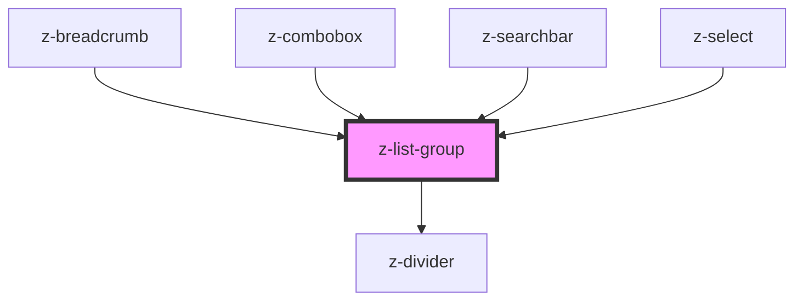

# z-list-group

<!-- Auto Generated Below -->

## Properties

| Property       | Attribute       | Description                                               | Type                                                                                       | Default                |
| -------------- | --------------- | --------------------------------------------------------- | ------------------------------------------------------------------------------------------ | ---------------------- |
| `dividerColor` | `divider-color` | [optional] Sets the divider color.                        | `string`                                                                                   | `"gray200"`            |
| `dividerSize`  | `divider-size`  | [optional] Sets the divider size.                         | `DividerSize.LARGE \| DividerSize.MEDIUM \| DividerSize.SMALL`                             | `DividerSize.SMALL`    |
| `dividerType`  | `divider-type`  | [optional] Sets the position where to insert the divider. | `ListDividerType.ELEMENT \| ListDividerType.HEADER \| ListDividerType.NONE`                | `ListDividerType.NONE` |
| `listType`     | `list-type`     | [optional] type of the list marker for each element       | `ListType.NONE \| ListType.ORDERED \| ListType.UNORDERED`                                  | `ListType.NONE`        |
| `size`         | `size`          | [optional] Sets size of inside elements.                  | `ListSize.LARGE \| ListSize.MEDIUM \| ListSize.NONE \| ListSize.SMALL \| ListSize.X_LARGE` | `ListSize.MEDIUM`      |

## Dependencies

### Used by

 - [z-breadcrumb](../../z-breadcrumb)
 - [z-combobox](../../z-combobox)
 - [z-searchbar](../../z-searchbar)
 - [z-select](../../z-select)

### Depends on

- [z-divider](../../z-divider)

### Graph

----------------------------------------------

*Built with [StencilJS](https://stenciljs.com/)*
