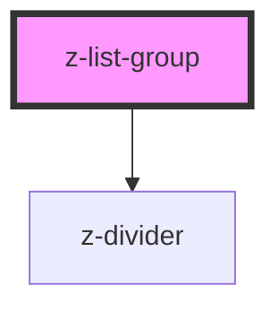

# z-list-group

<!-- Auto Generated Below -->

## Properties

| Property          | Attribute          | Description                                               | Type                                                                                | Default                          |
| ----------------- | ------------------ | --------------------------------------------------------- | ----------------------------------------------------------------------------------- | -------------------------------- |
| `alignButton`     | `align-button`     | [optional] Align expandable button left or right.         | `ExpandableListButtonAlign.left \| ExpandableListButtonAlign.right`                 | `ExpandableListButtonAlign.left` |
| `dividerColor`    | `divider-color`    | [optional] Sets the divider color.                        | `string`                                                                            | `"gray200"`                      |
| `dividerSize`     | `divider-size`     | [optional] Sets the divider size.                         | `DividerSize.large \| DividerSize.medium \| DividerSize.small`                      | `DividerSize.small`              |
| `dividerType`     | `divider-type`     | [optional] Sets the position where to insert the divider. | `ListDividerType.element \| ListDividerType.header \| ListDividerType.none`         | `ListDividerType.none`           |
| `expandable`      | `expandable`       | [optional] Allow expandable behaviour.                    | `boolean`                                                                           | `false`                          |
| `expandableStyle` | `expandable-style` | [optional] Sets expandable style to element.              | `ExpandableListStyle.accordion \| ExpandableListStyle.menu`                         | `ExpandableListStyle.accordion`  |
| `size`            | `size`             | [optional] Sets size of inside elements.                  | `ListSize.large \| ListSize.medium \| ListSize.small \| typeof ListSize["x-large"]` | `ListSize.medium`                |

## Dependencies

### Depends on

- [z-divider](../../z-divider)

### Graph

----------------------------------------------

*Built with [StencilJS](https://stenciljs.com/)*
