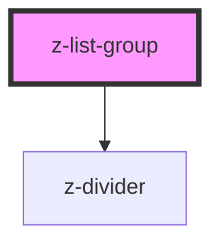

# z-list-group

<!-- Auto Generated Below -->

## Properties

| Property      | Attribute      | Description                              | Type                                                                                | Default                |
| ------------- | -------------- | ---------------------------------------- | ----------------------------------------------------------------------------------- | ---------------------- |
| `dividerType` | `divider-type` |                                          | `ListDividerType.element \| ListDividerType.header \| ListDividerType.none`         | `ListDividerType.none` |
| `size`        | `size`         | [optional] Sets size of inside elements. | `ListSize.large \| ListSize.medium \| ListSize.small \| typeof ListSize["x-large"]` | `ListSize.medium`      |

## Dependencies

### Depends on

- [z-divider](../../z-divider)

### Graph

----------------------------------------------

*Built with [StencilJS](https://stenciljs.com/)*
