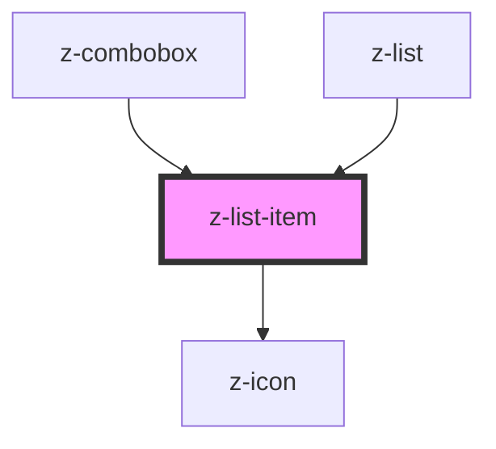

# z-list-item

<!-- readme-group="list" -->

```html
<z-list-item text="testo"></z-list-item>
<z-list-item text="testo" link="http://www.google.it"></z-list-item>`
```

<!-- Auto Generated Below -->

## Properties

| Property     | Attribute    | Description                      | Type      | Default     |
| ------------ | ------------ | -------------------------------- | --------- | ----------- |
| `action`     | `action`     | data-action attribute (optional) | `string`  | `undefined` |
| `icon`       | `icon`       | icon name (optional)             | `string`  | `undefined` |
| `link`       | `link`       | link url (optional)              | `string`  | `undefined` |
| `linktarget` | `linktarget` | link target (optional)           | `string`  | `"_self"`   |
| `listitemid` | `listitemid` | id (optional)                    | `string`  | `undefined` |
| `text`       | `text`       | content text                     | `string`  | `undefined` |
| `underlined` | `underlined` | underlined style flag            | `boolean` | `true`      |

## Events

| Event                | Description                                     | Type               |
| -------------------- | ----------------------------------------------- | ------------------ |
| `zListItemClick`     | emitted on list item click, returns listitemid  | `CustomEvent<any>` |
| `zListItemLinkClick` | emitted on list item link click, returns linkId | `CustomEvent<any>` |

## Dependencies

### Used by

- [z-combobox](../../inputs/z-combobox)
- [z-list](../z-list)

### Depends on

- [z-icon](../../icons/z-icon)

### Graph



---

_Built with [StencilJS](https://stenciljs.com/)_
