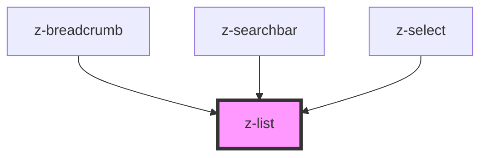

# z-list

<!-- Auto Generated Below -->

## Properties

| Property   | Attribute   | Description                                         | Type                                                                      | Default           |
| ---------- | ----------- | --------------------------------------------------- | ------------------------------------------------------------------------- | ----------------- |
| `listType` | `list-type` | [optional] type of the list marker for each element | `ListType.NONE \| ListType.ORDERED \| ListType.UNORDERED`                 | `ListType.NONE`   |
| `role`     | `role`      | Sets role of the element.                           | `string`                                                                  | `"list"`          |
| `size`     | `size`      | [optional] Sets size of inside elements.            | `ListSize.LARGE \| ListSize.MEDIUM \| ListSize.SMALL \| ListSize.X_LARGE` | `ListSize.MEDIUM` |

## Dependencies

### Used by

 - [z-breadcrumb](../../z-breadcrumb)
 - [z-searchbar](../../inputs/z-searchbar)
 - [z-select](../../inputs/z-select)

### Graph

----------------------------------------------

*Built with [StencilJS](https://stenciljs.com/)*
