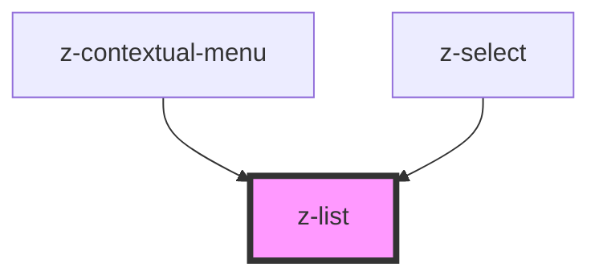

# z-list

<!-- Auto Generated Below -->

## Properties

| Property | Attribute | Description                              | Type                                                                      | Default           |
| -------- | --------- | ---------------------------------------- | ------------------------------------------------------------------------- | ----------------- |
| `size`   | `size`    | [optional] Sets size of inside elements. | `ListSize.LARGE \| ListSize.MEDIUM \| ListSize.SMALL \| ListSize.X_LARGE` | `ListSize.MEDIUM` |

## Dependencies

### Used by

- [z-contextual-menu](../../z-contextual-menu)
- [z-select](../../inputs/z-select)

### Graph

---

_Built with [StencilJS](https://stenciljs.com/)_
