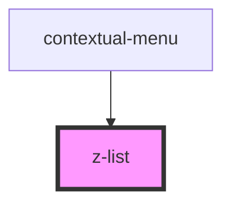

# z-list

<!-- Auto Generated Below -->

## Properties

| Property | Attribute | Description                              | Type                                                                                | Default           |
| -------- | --------- | ---------------------------------------- | ----------------------------------------------------------------------------------- | ----------------- |
| `size`   | `size`    | [optional] Sets size of inside elements. | `ListSize.large \| ListSize.medium \| ListSize.small \| typeof ListSize["x-large"]` | `ListSize.medium` |

## Dependencies

### Used by

 - [contextual-menu](../../contextual-menu)

### Graph

----------------------------------------------

*Built with [StencilJS](https://stenciljs.com/)*
