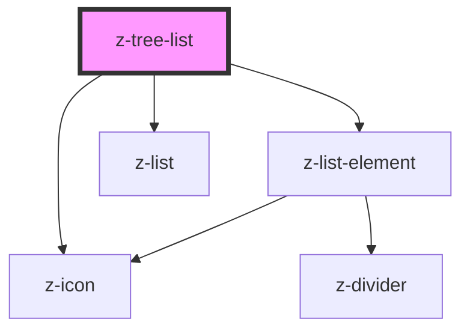

# z-tree-list

<!-- Auto Generated Below -->

## Properties

| Property             | Attribute              | Description                                                                             | Type                       | Default     |
| -------------------- | ---------------------- | --------------------------------------------------------------------------------------- | -------------------------- | ----------- |
| `htmlAriaLabelledby` | `html-aria-labelledby` | Used for aria-labelledby attribute, sets name in "navigation"                           | `string`                   | `undefined` |
| `htmlSectionTitle`   | `html-section-title`   | Used for aria-label attribute, sets name in "tree"                                      | `string`                   | `undefined` |
| `items`              | `items`                | Items to render, if they have the url property they will be rendered as clickable links | `TreeListItem[] \| string` | `[]`        |

## Events

| Event             | Description                                                               | Type                                                      |
| ----------------- | ------------------------------------------------------------------------- | --------------------------------------------------------- |
| `treeItemClicked` | Emitted on item click, it return the id, name and url of the clicked item | `CustomEvent<{ id: string; name: string; url: string; }>` |

## Dependencies

### Depends on

- [z-list-element](../z-list-element)
- [z-icon](../../z-icon)
- [z-list](../z-list)

### Graph

----------------------------------------------

*Built with [StencilJS](https://stenciljs.com/)*
