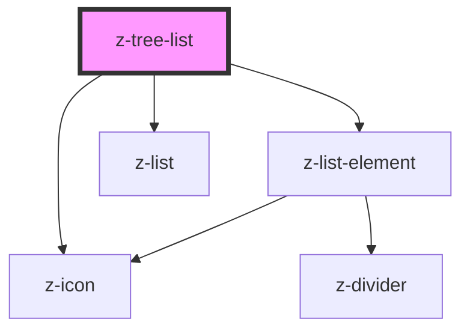

# z-tree-list

<!-- Auto Generated Below -->

## Properties

| Property    | Attribute   | Description        | Type             | Default     |
| ----------- | ----------- | ------------------ | ---------------- | ----------- |
| `clickable` | `clickable` | Items is clickable | `boolean`        | `undefined` |
| `items`     | --          | Items to render    | `TreeListItem[]` | `[]`        |

## Events

| Event         | Description           | Type                                                                                                                                    |
| ------------- | --------------------- | --------------------------------------------------------------------------------------------------------------------------------------- |
| `itemClicked` | Emitted on item click | `CustomEvent<{ id: string; name: string; url: string; icon?: string; disabled?: boolean; bold?: boolean; children?: TreeListItem[]; }>` |

## Dependencies

### Depends on

- [z-list-element](../z-list-element)
- [z-icon](../../z-icon)
- [z-list](../z-list)

### Graph

----------------------------------------------

*Built with [StencilJS](https://stenciljs.com/)*
