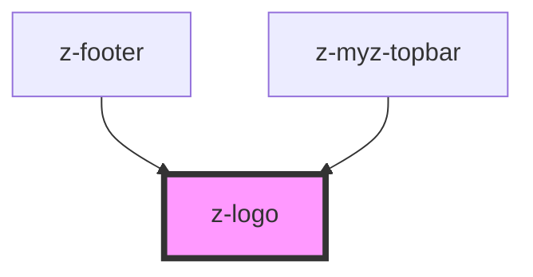

# z-logo

<!-- readme-group="logo" -->
```html
<z-logo ></z-logo>
<z-logo imagealt="logo" ></z-logo>
<z-logo imagealt="logo" height="50" width="200"></z-logo>
<z-logo imagealt="logo" height="25" width="100"></z-logo>
```

<!-- Auto Generated Below -->


## Properties

| Property      | Attribute     | Description                                       | Type      | Default     |
| ------------- | ------------- | ------------------------------------------------- | --------- | ----------- |
| `height`      | `height`      | image height                                      | `number`  | `undefined` |
| `imagealt`    | `imagealt`    | alternative image text                            | `string`  | `undefined` |
| `link`        | `link`        | link url (optional)                               | `string`  | `undefined` |
| `targetblank` | `targetblank` | link target: true means _blank, false means _self | `boolean` | `undefined` |
| `width`       | `width`       | image width                                       | `number`  | `undefined` |


## Dependencies

### Used by

 - [z-footer](../../footer/z-footer)
 - [z-myz-topbar](../../../snowflakes/myz/topbar)

### Graph


----------------------------------------------

*Built with [StencilJS](https://stenciljs.com/)*
