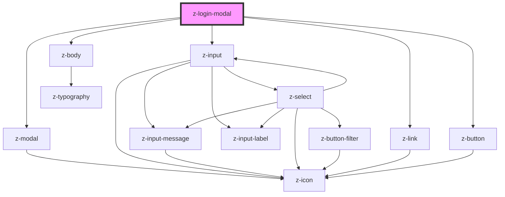

# z-login-modal

<!-- Auto Generated Below -->

## Properties

| Property  | Attribute | Description                    | Type                                               | Default     |
| --------- | --------- | ------------------------------ | -------------------------------------------------- | ----------- |
| `message` | `message` | Username helper message        | `string`                                           | `undefined` |
| `status`  | `status`  | Username/password input status | `"error" \| "selecting" \| "success" \| "warning"` | `undefined` |

## Events

| Event                | Description                            | Type               |
| -------------------- | -------------------------------------- | ------------------ |
| `facebookClick`      | Emitted on facebook button click       | `CustomEvent<any>` |
| `googleClick`        | Emitted on google button click         | `CustomEvent<any>` |
| `loginSubmit`        | Emitted on login submit                | `CustomEvent<any>` |
| `signupClick`        | Emitted on signup button click         | `CustomEvent<any>` |
| `zainoDigitaleClick` | Emitted on zaino digitale button click | `CustomEvent<any>` |

## Slots

| Slot         | Description                       |
| ------------ | --------------------------------- |
| `"login"`    | login button                      |
| `"password"` | password input                    |
| `"provider"` | expternal providers login buttons |
| `"signup"`   | signup button                     |
| `"username"` | username input                    |

## Dependencies

### Depends on

- [z-modal](../z-modal)
- [z-input](../../inputs/z-input)
- [z-link](../../navigation/z-link)
- [z-button](../../buttons/z-button)
- [z-body](../../typography/z-body)

### Graph

----------------------------------------------

*Built with [StencilJS](https://stenciljs.com/)*
