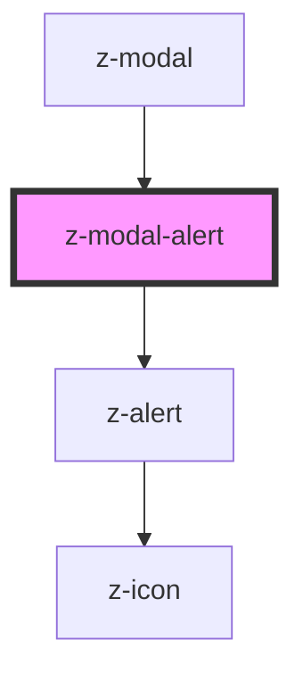

# z-modal-alert

<!-- Auto Generated Below -->

## Properties

| Property      | Attribute     | Description        | Type                                                                       | Default     |
| ------------- | ------------- | ------------------ | -------------------------------------------------------------------------- | ----------- |
| `actiontext`  | `actiontext`  | action button text | `string`                                                                   | `undefined` |
| `contenttext` | `contenttext` | content text       | `string`                                                                   | `undefined` |
| `iconname`    | `iconname`    | icon name          | `string`                                                                   | `undefined` |
| `type`        | `type`        | alert variant type | `AlertTypesEnum.error \| AlertTypesEnum.success \| AlertTypesEnum.warning` | `undefined` |

## Dependencies

### Used by

 - [z-modal](../z-modal)

### Depends on

- [z-alert](../../notification/z-alert)

### Graph

----------------------------------------------

*Built with [StencilJS](https://stenciljs.com/)*
