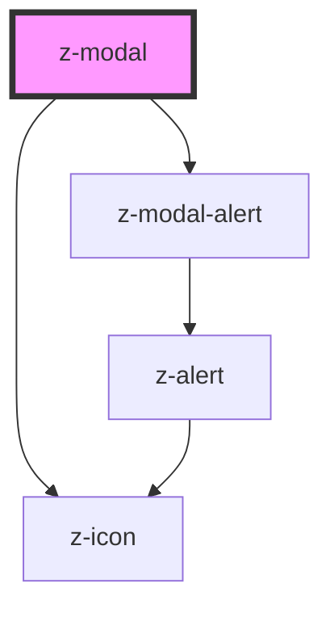

# z-modal

<!-- readme-group="modal" -->
```html
<z-modal modaltitle="titolotitolo" modalsubtitle="sottotitolo">{modalcontent slot}</z-modal>
```

<!-- Auto Generated Below -->


## Properties

| Property          | Attribute         | Description                   | Type      | Default     |
| ----------------- | ----------------- | ----------------------------- | --------- | ----------- |
| `alertactiontext` | `alertactiontext` | alert action text (optional)  | `string`  | `undefined` |
| `alerticon`       | `alerticon`       | alert icon (optional)         | `string`  | `undefined` |
| `alerttext`       | `alerttext`       | alert content text (optional) | `string`  | `undefined` |
| `alerttype`       | `alerttype`       | alert type (optional)         | `string`  | `undefined` |
| `modalid`         | `modalid`         | unique id                     | `string`  | `undefined` |
| `modalsubtitle`   | `modalsubtitle`   | subtitle (optional)           | `string`  | `undefined` |
| `modaltitle`      | `modaltitle`      | title text (optional)         | `string`  | `undefined` |
| `showalert`       | `showalert`       | alert visibility flag         | `boolean` | `undefined` |


## Events

| Event               | Description                                    | Type               |
| ------------------- | ---------------------------------------------- | ------------------ |
| `modalClose`        | emitted on close icon click, returns modalid   | `CustomEvent<any>` |
| `modalHeaderActive` | emitted on modal header click, returns modalid | `CustomEvent<any>` |


## Slots

| Slot             | Description                  |
| ---------------- | ---------------------------- |
| `"modalContent"` | set the content of the modal |


## Dependencies

### Depends on

- [z-modal-alert](../z-modal-alert)
- [z-icon](../../icons/z-icon)

### Graph


----------------------------------------------

*Built with [StencilJS](https://stenciljs.com/)*
