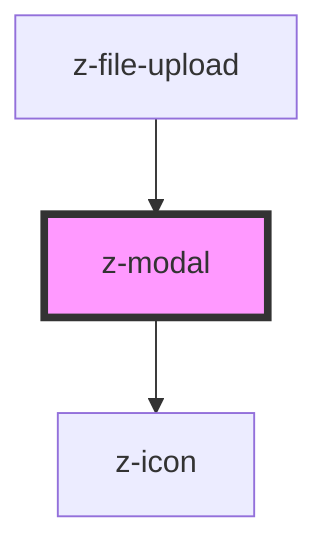

# z-modal

<!-- readme-group="modal" -->

```html
<z-modal
  modaltitle="titolotitolo"
  modalsubtitle="sottotitolo"
  >{modalcontent slot}</z-modal
>
```

<!-- Auto Generated Below -->


## Properties

| Property           | Attribute            | Description                                                   | Type      | Default           |
| ------------------ | -------------------- | ------------------------------------------------------------- | --------- | ----------------- |
| `alertdialog`      | `alertdialog`        | add role "alertdialog" to dialog (optional, default is false) | `boolean` | `false`           |
| `closable`         | `closable`           | if true, the modal is closable (optional, default is true)    | `boolean` | `true`            |
| `closeButtonLabel` | `close-button-label` | aria-label for close button (optional)                        | `string`  | `"chiudi modale"` |
| `modalid`          | `modalid`            | unique id                                                     | `string`  | `undefined`       |
| `modalsubtitle`    | `modalsubtitle`      | subtitle (optional)                                           | `string`  | `undefined`       |
| `modaltitle`       | `modaltitle`         | title text (optional)                                         | `string`  | `undefined`       |
| `scrollable`       | `scrollable`         | if true, the modal content is scrollable                      | `boolean` | `true`            |


## Events

| Event                  | Description                                    | Type               |
| ---------------------- | ---------------------------------------------- | ------------------ |
| `modalBackgroundClick` | emitted on background click, returns modalid   | `CustomEvent<any>` |
| `modalClose`           | emitted on close button click, returns modalid | `CustomEvent<any>` |
| `modalHeaderActive`    | emitted on modal header click, returns modalid | `CustomEvent<any>` |


## Methods

### `close() => Promise<void>`

close modal

#### Returns

Type: `Promise<void>`


### `open() => Promise<void>`

open modal

#### Returns

Type: `Promise<void>`


## Slots

| Slot                 | Description                  |
| -------------------- | ---------------------------- |
| `"modalCloseButton"` | accept custom close button   |
| `"modalContent"`     | set the content of the modal |


## Dependencies

### Used by

 - [z-file-upload](../../file-upload/z-file-upload)

### Depends on

- [z-icon](../../icons/z-icon)

### Graph


----------------------------------------------

*Built with [StencilJS](https://stenciljs.com/)*
