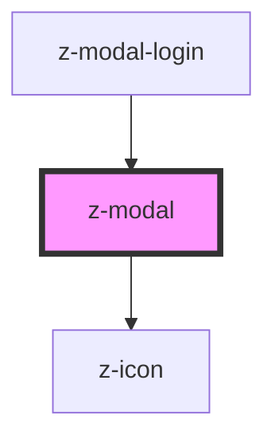

# z-modal

<!-- readme-group="modal" -->

```html
<z-modal modaltitle="titolotitolo" modalsubtitle="sottotitolo"
  >{modalcontent slot}</z-modal
>
```

<!-- Auto Generated Below -->

## Properties

| Property        | Attribute       | Description           | Type     | Default     |
| --------------- | --------------- | --------------------- | -------- | ----------- |
| `modalid`       | `modalid`       | unique id             | `string` | `undefined` |
| `modalsubtitle` | `modalsubtitle` | subtitle (optional)   | `string` | `undefined` |
| `modaltitle`    | `modaltitle`    | title text (optional) | `string` | `undefined` |

## Events

| Event                  | Description                                    | Type               |
| ---------------------- | ---------------------------------------------- | ------------------ |
| `modalBackgroundClick` | emitted on background click, returns modalid   | `CustomEvent<any>` |
| `modalClose`           | emitted on close button click, returns modalid | `CustomEvent<any>` |
| `modalHeaderActive`    | emitted on modal header click, returns modalid | `CustomEvent<any>` |

## Slots

| Slot             | Description                  |
| ---------------- | ---------------------------- |
| `"modalContent"` | set the content of the modal |

## Dependencies

### Used by

- [z-modal-login](../z-modal-login)

### Depends on

- [z-icon](../../icons/z-icon)

### Graph



---

_Built with [StencilJS](https://stenciljs.com/)_
