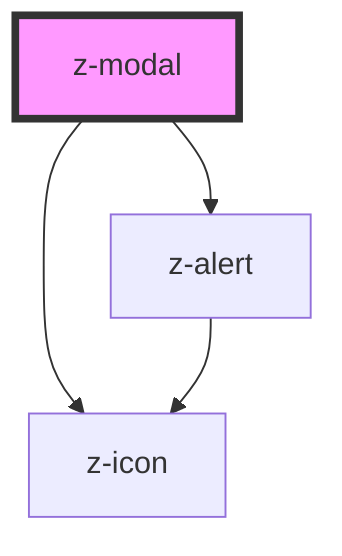

# z-modal

<!-- readme-group="modal" -->
```html
<z-modal modaltitle="titolotitolo" modalsubtitle="sottotitolo">{modalcontent slot}</z-modal>
```

<!-- Auto Generated Below -->


## Properties

| Property        | Attribute       | Description                 | Type                                                                                           | Default     |
| --------------- | --------------- | --------------------------- | ---------------------------------------------------------------------------------------------- | ----------- |
| `alertdata`     | --              | modal alert data (optional) | `{ iconname: string; contenttext: string; type: string; actiontext?: string; show: boolean; }` | `undefined` |
| `modalid`       | `modalid`       | unique id                   | `string`                                                                                       | `undefined` |
| `modalsubtitle` | `modalsubtitle` | subtitle (optional)         | `string`                                                                                       | `undefined` |
| `modaltitle`    | `modaltitle`    | title text (optional)       | `string`                                                                                       | `undefined` |


## Events

| Event               | Description                                    | Type               |
| ------------------- | ---------------------------------------------- | ------------------ |
| `modalClose`        | emitted on close icon click, returns modalid   | `CustomEvent<any>` |
| `modalHeaderActive` | emitted on modal header click, returns modalid | `CustomEvent<any>` |


## Slots

| Slot             | Description                  |
| ---------------- | ---------------------------- |
| `"modalContent"` | set the content of the modal |


## Dependencies

### Depends on

- [z-alert](../../notification/z-alert)
- [z-icon](../../icons/z-icon)

### Graph


----------------------------------------------

*Built with [StencilJS](https://stenciljs.com/)*
