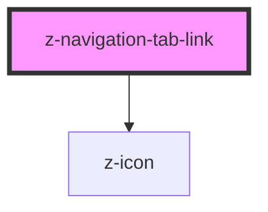

# z-navigation-tab

<!-- readme-group="pagination" -->
```html
<z-navigation-tab pageId='10' value='10'></z-navigation-tab>
<z-navigation-tab pageId='10' value='10' isdisabled></z-navigation-tab>
<z-navigation-tab pageId='10' value='10' isselected isvisited></z-navigation-tab>
```


<!-- Auto Generated Below -->


## Properties

| Property      | Attribute     | Description                                                                                                                                                  | Type                         | Default                                 |
| ------------- | ------------- | ------------------------------------------------------------------------------------------------------------------------------------------------------------ | ---------------------------- | --------------------------------------- |
| `disabled`    | `disabled`    | Whether the tab is disabled.                                                                                                                                 | `boolean`                    | `false`                                 |
| `href`        | `href`        | Url to set to the anchor element.                                                                                                                            | `string`                     | `undefined`                             |
| `htmlTitle`   | `html-title`  | Html title attribute for the anchor element.                                                                                                                 | `string`                     | `undefined`                             |
| `icon`        | `icon`        | Name of the icon to use. Use the slot `icon` for extra customization. The `filled` version will be automatically used (if found) when the tab is `selected`. | `string`                     | `undefined`                             |
| `label`       | `label`       | Label to show in the tab.                                                                                                                                    | `string`                     | `undefined`                             |
| `orientation` | `orientation` | Tab orientation. Do not set this manually: `z-navigation-tabs` will handle this.                                                                             | `"horizontal" \| "vertical"` | `NavigationTabsOrientations.horizontal` |
| `selected`    | `selected`    | Whether the tab is selected.                                                                                                                                 | `boolean`                    | `false`                                 |
| `size`        | `size`        | Tab size. Do not set this manually: `z-navigation-tabs` will handle this.                                                                                    | `"big" \| "small"`           | `NavigationTabsSizes.big`               |
| `target`      | `target`      | Html `target` attribute for the anchor element.                                                                                                              | `string`                     | `undefined`                             |


## Events

| Event      | Description | Type               |
| ---------- | ----------- | ------------------ |
| `selected` |             | `CustomEvent<any>` |


## Slots

| Slot     | Description                                                                                 |
| -------- | ------------------------------------------------------------------------------------------- |
| `"icon"` | Tab icon. If no extra customization is needed, use the `icon` prop passing the icon's name. |


## Dependencies

### Depends on

- [z-icon](../../../icons/z-icon)

### Graph


----------------------------------------------

*Built with [StencilJS](https://stenciljs.com/)*
