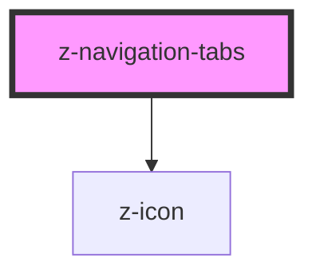

# z-navigation-tabs

<!-- Auto Generated Below -->

## Properties

| Property      | Attribute     | Description                  | Type                                                                           | Default                                 |
| ------------- | ------------- | ---------------------------- | ------------------------------------------------------------------------------ | --------------------------------------- |
| `orientation` | `orientation` | Navigation tabs orientation. | `NavigationTabsOrientations.HORIZONTAL \| NavigationTabsOrientations.VERTICAL` | `NavigationTabsOrientations.HORIZONTAL` |
| `size`        | `size`        | Navigation tabs size.        | `NavigationTabsSizes.BIG \| NavigationTabsSizes.SMALL`                         | `NavigationTabsSizes.BIG`               |

## Slots

| Slot | Description                                                                          |
| ---- | ------------------------------------------------------------------------------------ |
|      | Main slot. Use `z-navigation-tab` or `z-navigation-tab-link` components as children. |

## Dependencies

### Depends on

- [z-icon](../../../icons/z-icon)

### Graph

---

_Built with [StencilJS](https://stenciljs.com/)_
