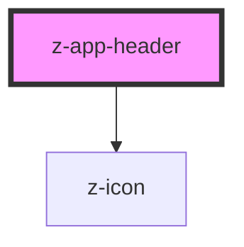

# z-app-header

<!-- Auto Generated Below -->

## Properties

| Property  | Attribute | Description                                                                                                            | Type      | Default     |
| --------- | --------- | ---------------------------------------------------------------------------------------------------------------------- | --------- | ----------- |
| `drawer`  | `drawer`  | Collapse the menu container into a side drawer, for a better experience on mobile devices. **Optional**                | `boolean` | `false`     |
| `hero`    | `hero`    | Set the hero image source for the header. You can also use a slot="hero" node for advanced customisation. **Optional** | `string`  | `undefined` |
| `overlay` | `overlay` | Should place an overlay over the hero image. Useful for legibility purpose. **Optional**                               | `boolean` | `false`     |
| `stuck`   | `stuck`   | Stuck mode for the header. You can programmatically set it using an IntersectionObserver. **Optional**                 | `boolean` | `false`     |

## Dependencies

### Depends on

- [z-icon](../../icons/z-icon)

### Graph

----------------------------------------------

*Built with [StencilJS](https://stenciljs.com/)*
