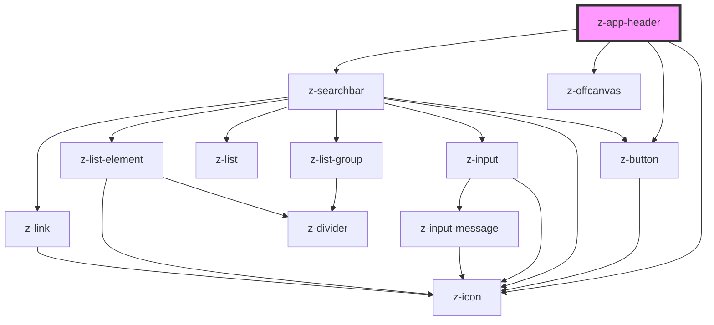

# z-app-header

<!-- Auto Generated Below -->

## Properties

| Property            | Attribute            | Description                                                                                                                                                                                                                                    | Type                               | Default     |
| ------------------- | -------------------- | ---------------------------------------------------------------------------------------------------------------------------------------------------------------------------------------------------------------------------------------------- | ---------------------------------- | ----------- |
| `drawerOpen`        | `drawer-open`        | The opening state of the drawer.                                                                                                                                                                                                               | `boolean`                          | `false`     |
| `enableSearch`      | `enable-search`      | Enable the search bar.                                                                                                                                                                                                                         | `boolean`                          | `false`     |
| `flow`              | `flow`               | Control menu bar position in the header. - auto: the menu bar is positioned near the title - stack: the menu bar is positioned below the title - offcanvas: the menu bar is not displayed and a burger icon appears to open the offcanvas menu | `"auto" \| "offcanvas" \| "stack"` | `"auto"`    |
| `hero`              | `hero`               | Set the hero image source for the header. You can also use a slot="hero" node for advanced customization.                                                                                                                                      | `string`                           | `undefined` |
| `overlay`           | `overlay`            | Should place an overlay over the hero image. Useful for legibility purpose.                                                                                                                                                                    | `boolean`                          | `false`     |
| `searchPageUrl`     | `search-page-url`    | Url to the search page. Set this prop and `enableSearch` to show a link-button on mobile and tablet viewports, instead of the normal searchbar. The link will also appear on the sticky header.                                                | `string`                           | `undefined` |
| `searchPlaceholder` | `search-placeholder` | Placeholder text for the search bar.                                                                                                                                                                                                           | `string`                           | `"Cerca"`   |
| `stuck`             | `stuck`              | Stuck mode for the header. You can programmatically set it using an IntersectionObserver.                                                                                                                                                      | `boolean`                          | `false`     |

## Events

| Event      | Description                                          | Type               |
| ---------- | ---------------------------------------------------- | ------------------ |
| `sticking` | Emitted when the `stuck` state of the header changes | `CustomEvent<any>` |

## Slots

| Slot              | Description                                                                    |
| ----------------- | ------------------------------------------------------------------------------ |
| `"stucked-title"` | Title for the stuck header. By default it uses the text from the `title` slot. |
| `"subtitle"`      | Slot for the subtitle. It will not appear in stuck header.                     |
| `"title"`         | Slot for the main title                                                        |

## Dependencies

### Depends on

- [z-button](../../buttons/z-button)
- [z-icon](../../icons/z-icon)
- [z-searchbar](../../inputs/z-searchbar)
- [z-offcanvas](../../z-offcanvas)

### Graph

----------------------------------------------

*Built with [StencilJS](https://stenciljs.com/)*
