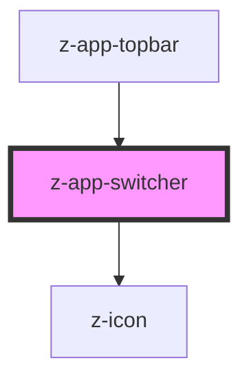

# z-app-menu

<!-- Auto Generated Below -->

## Properties

| Property | Attribute | Description                   | Type                                      | Default             |
| -------- | --------- | ----------------------------- | ----------------------------------------- | ------------------- |
| `theme`  | `theme`   | theme variant, default 'dark' | `ThemeVariant.DARK \| ThemeVariant.LIGHT` | `ThemeVariant.DARK` |

## Events

| Event            | Description                                                 | Type               |
| ---------------- | ----------------------------------------------------------- | ------------------ |
| `appButtonClick` | emitted on app button icon click, returns open/closed state | `CustomEvent<any>` |

## Dependencies

### Used by

- [z-app-topbar](../z-app-topbar)

### Depends on

- [z-icon](../../icons/z-icon)

### Graph

---

_Built with [StencilJS](https://stenciljs.com/)_
