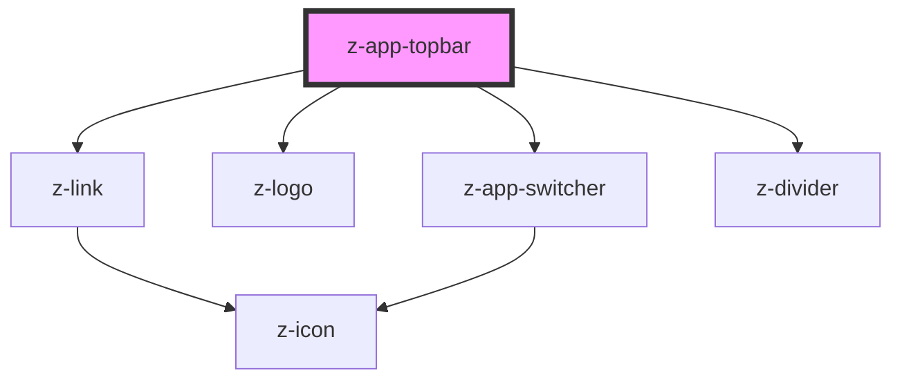

# z-topbar

<!-- Auto Generated Below -->

## Properties

| Property          | Attribute         | Description                                    | Type                                      | Default             |
| ----------------- | ----------------- | ---------------------------------------------- | ----------------------------------------- | ------------------- |
| `contentmaxwidth` | `contentmaxwidth` | maximum width of topbar content                | `number`                                  | `undefined`         |
| `logolink`        | `logolink`        | the link used by z-logo                        | `string`                                  | `undefined`         |
| `showappswitcher` | `showappswitcher` | add app-switcher                               | `boolean`                                 | `undefined`         |
| `theme`           | `theme`           | theme variant, default 'dark'                  | `ThemeVariant.dark \| ThemeVariant.light` | `ThemeVariant.dark` |
| `topbarcontent`   | `topbarcontent`   | Json stringified or array to fill topbar links | `MenuItem[] \| string`                    | `undefined`         |

## Dependencies

### Depends on

- [z-link](../z-link)
- [z-logo](../../logo/z-logo)
- [z-app-switcher](../z-app-switcher)
- [z-divider](../../z-divider)

### Graph

----------------------------------------------

*Built with [StencilJS](https://stenciljs.com/)*
