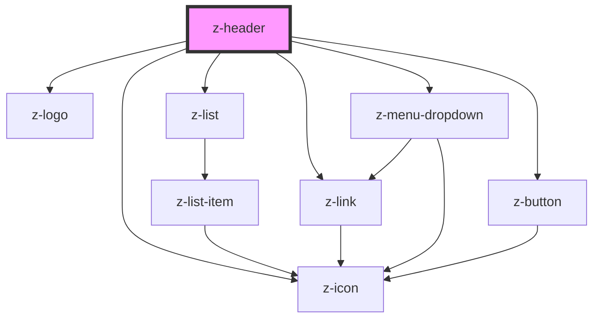

# z-header

<!-- readme-group="header" -->
```html
  <z-header
    intlinkdata='[{"id":"home","label":"Home","link":"#home","subMenu":[{"id":"libreria","label":"La mia libreria","link":"#libreria"},{"id":"idee","label":"Siti Zanichelli","link":"#idee"}]},{"id":"dizionari","label":"Dizionari","link":"https://www.zanichelli.it/dizionari"}]'
    extlinkdata='[{"id":"MyZanichelli","label":"Link a MyZanichelli","link":"http://www.myzanichelli.it","icon":"circle-chevron-left"}]'
    userdata='{
        "islogged": true,
        "id": 123456,
        "name": "Dario Docente",
        "usergroup": 15,
        "userlinks": [{"id":"profile","label":"Profilo","link":"/i-tuoi-dati","icon":"user"},{"id":"activate-resource","label":"Attiva libro","link":"#","icon":"plus"},{"id":"logout-button","label":"Esci","link":"/logout","icon":"logout"}]
      }' ismyz=false imagealt="none">
  {editors slot}
  </z-header>
  <z-header
    intlinkdata='[{"id":"home","label":"Home","link":"#home","subMenu":[{"id":"libreria","label":"La mia libreria","link":"#libreria"},{"id":"idee","label":"Siti Zanichelli","link":"#idee"}]},{"id":"dizionari","label":"Dizionari","link":"https://www.zanichelli.it/dizionari"}]'
    extlinkdata='[{"id":"supporto","label":"Supporto","link":"http://www.zanichelli.it/contatti/supporto","icon":"question-mark"},{"id":"shop","label":"Carrello","link":"https://www.zanichelli.it","icon":"cart"},{"id":"chiedi","label":"Chiedi al tuo responsabile","link":"#","icon":"ask-your-manager"}]'
    userdata='{
        "islogged": false,
        "id": 123456,
        "name": "Dario Docente",
        "usergroup": 15,
        "userlinks": [{"id":"profile","label":"Profilo","link":"/i-tuoi-dati","icon":"user"},{"id":"activate-resource","label":"Attiva libro","link":"#","icon":"plus"},{"id":"logout-button","label":"Esci","link":"/logout","icon":"logout"}]
      }' ismyz=false imagealt="none">
  {editors slot}
  </z-header>
  <z-header
    intlinkdata='[{"id":"home","label":"Home","link":"#home","subMenu":[{"id":"libreria","label":"La mia libreria","link":"#libreria"},{"id":"idee","label":"Siti Zanichelli","link":"#idee"}]},{"id":"dizionari","label":"Dizionari","link":"https://www.zanichelli.it/dizionari"}]'
    extlinkdata='[{"id":"supporto","label":"Supporto","link":"http://www.zanichelli.it/contatti/supporto","icon":"question-mark"},{"id":"shop","label":"Carrello","link":"https://www.zanichelli.it","icon":"cart"},{"id":"chiedi","label":"Chiedi al tuo responsabile","link":"#","icon":"ask-your-manager"}]'
    userdata='{
        "islogged": true,
        "id": 123456,
        "name": "Dario Docente",
        "usergroup": 15,
        "userlinks": [{"id":"profile","label":"Profilo","link":"/i-tuoi-dati","icon":"user"},{"id":"activate-resource","label":"Attiva libro","link":"#","icon":"plus"},{"id":"logout-button","label":"Esci","link":"/logout","icon":"logout"}]
      }' ismyz=true imagealt="none"
    activeintlinkid="home" activesublinkid="idee">
  {editors slot}
  </z-header>
  <z-header
    intlinkdata='[{"id":"home","label":"Home","link":"#home","subMenu":[{"id":"libreria","label":"La mia libreria","link":"#libreria"},{"id":"idee","label":"Siti Zanichelli","link":"#idee"}]},{"id":"dizionari","label":"Dizionari","link":"https://www.zanichelli.it/dizionari"}]'
    extlinkdata='[{"id":"supporto","label":"Supporto","link":"http://www.zanichelli.it/contatti/supporto","icon":"question-mark"},{"id":"shop","label":"Carrello","link":"https://www.zanichelli.it","icon":"cart"},{"id":"chiedi","label":"Chiedi al tuo responsabile","link":"#","icon":"ask-your-manager"}]'
    userdata='{
        "islogged": false,
        "id": 123456,
        "name": "Dario Docente",
        "usergroup": 15,
        "userlinks": [{"id":"profile","label":"Profilo","link":"/i-tuoi-dati","icon":"user"},{"id":"activate-resource","label":"Attiva libro","link":"#","icon":"plus"},{"id":"logout-button","label":"Esci","link":"/logout","icon":"logout"}]
      }' ismyz=true imagealt="none">
  {editors slot}
  </z-header>
  <z-header
    intlinkdata='[{"id":"home","label":"Home","link":"#home","subMenu":[{"id":"libreria","label":"I miei Libri","link":"#libreria"},{"id":"idee","label":"Siti Zanichelli","link":"#idee"}]},{"id":"dizionari","label":"Dizionari","link":"https://www.zanichelli.it/dizionari"}]'
    extlinkdata='[{"id":"supporto","label":"Supporto","link":"http://www.zanichelli.it/contatti/supporto","icon":"question-mark"},{"id":"shop","label":"Carrello","link":"https://www.zanichelli.it","icon":"cart"}]'
    userdata='{
            "islogged": true,
            "id": 123456,
            "name": "Sandro Studente",
            "usergroup": 14,
            "userlinks": [{"id":"profile","label":"Profilo","link":"/i-tuoi-dati","icon":"user"},{"id":"logout-button","label":"Esci","link":"/logout","icon":"logout"}]
          }' ismyz=true imagealt="none">
  {editors slot}
  </z-header>
```

<!-- Auto Generated Below -->


## Properties

| Property          | Attribute         | Description                                 | Type                                                                                                     | Default     |
| ----------------- | ----------------- | ------------------------------------------- | -------------------------------------------------------------------------------------------------------- | ----------- |
| `activeintlinkid` | `activeintlinkid` | set current active menu link (optional)     | `string`                                                                                                 | `undefined` |
| `activesublinkid` | `activesublinkid` | set current active sub menu link (optional) | `string`                                                                                                 | `undefined` |
| `extlinkdata`     | `extlinkdata`     | data to fill external navigation links      | `MenuItem[] \| string`                                                                                   | `undefined` |
| `imagealt`        | `imagealt`        | alternative logo title text (optional)      | `string`                                                                                                 | `undefined` |
| `intlinkdata`     | `intlinkdata`     | data to fill internal navigation links      | `MenuItem[] \| string`                                                                                   | `undefined` |
| `ismyz`           | `ismyz`           | graphic flag to set myzanichelli style      | `boolean`                                                                                                | `undefined` |
| `logolink`        | `logolink`        | url to attach to logo (optional)            | `string`                                                                                                 | `undefined` |
| `userdata`        | `userdata`        | data to fill user dropdown menu (optional)  | `string \| { islogged: boolean; id?: number; name?: string; usergroup: number; userlinks: MenuItem[]; }` | `undefined` |


## Slots

| Slot        | Description                                                 |
| ----------- | ----------------------------------------------------------- |
| `"editors"` | top menu editors images bar (only with ismyz prop === true) |


## Dependencies

### Depends on

- [z-logo](../../logo/z-logo)
- [z-list](../../list/z-list)
- [z-link](../z-link)
- [z-menu-dropdown](../z-menu-dropdown)
- [z-button](../../buttons/z-button)
- [z-icon](../../icons/z-icon)

### Graph


----------------------------------------------

*Built with [StencilJS](https://stenciljs.com/)*
