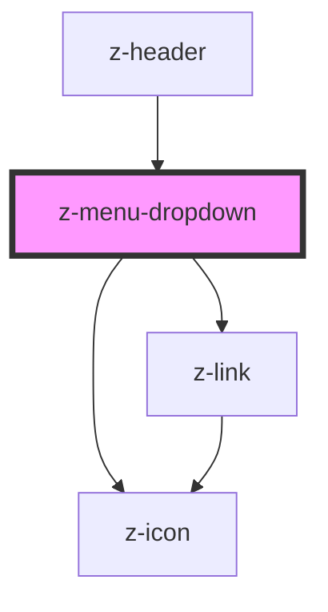

# z-menu-dropdown

<!-- readme-group="header" -->
```html
<z-menu-dropdown nomeutente="username molto lungo nome" menucontent='[{"id":"profile","label":"Profilo","link":"/i-tuoi-dati","icon":"user-avatar"},{"id":"activate-resource","label":"Attiva libro","link":"#","icon":"plus"},{"id":"logout-button","label":"Esci","link":"/logout","icon":"logout"}]'></z-menu-dropdown>
```


<!-- Auto Generated Below -->


## Properties

| Property      | Attribute     | Description                                     | Type                   | Default     |
| ------------- | ------------- | ----------------------------------------------- | ---------------------- | ----------- |
| `buttonid`    | `buttonid`    | unique button id                                | `string`               | `undefined` |
| `menucontent` | `menucontent` | Json stringified or array to fill menu dropdown | `MenuItem[] \| string` | `undefined` |
| `nomeutente`  | `nomeutente`  | user name text                                  | `string`               | `undefined` |


## Dependencies

### Used by

 - [z-header](../z-header)

### Depends on

- [z-link](../z-link)
- [z-icon](../../icons/z-icon)

### Graph


----------------------------------------------

*Built with [StencilJS](https://stenciljs.com/)*
