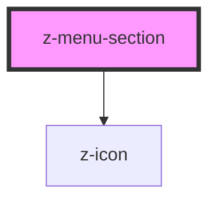

# z-menu-section

<!-- Auto Generated Below -->

## Properties

| Property | Attribute | Description | Type      | Default     |
| -------- | --------- | ----------- | --------- | ----------- |
| `active` | `active`  |             | `boolean` | `undefined` |

## Events

| Event    | Description                  | Type               |
| -------- | ---------------------------- | ------------------ |
| `closed` | The section has been closed. | `CustomEvent<any>` |
| `opened` | The section has been opened. | `CustomEvent<any>` |

## Dependencies

### Depends on

- [z-icon](../../icons/z-icon)

### Graph

----------------------------------------------

*Built with [StencilJS](https://stenciljs.com/)*
