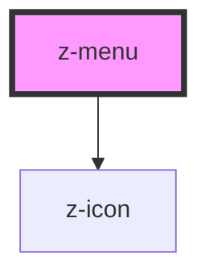

# z-menu

<!-- Auto Generated Below -->

## Properties

| Property | Attribute | Description | Type      | Default     |
| -------- | --------- | ----------- | --------- | ----------- |
| `active` | `active`  |             | `boolean` | `undefined` |

## Events

| Event     | Description                              | Type               |
| --------- | ---------------------------------------- | ------------------ |
| `toggled` | Emits `toggled` with current open state. | `CustomEvent<any>` |

## Dependencies

### Depends on

- [z-icon](../../icons/z-icon)

### Graph

----------------------------------------------

*Built with [StencilJS](https://stenciljs.com/)*
