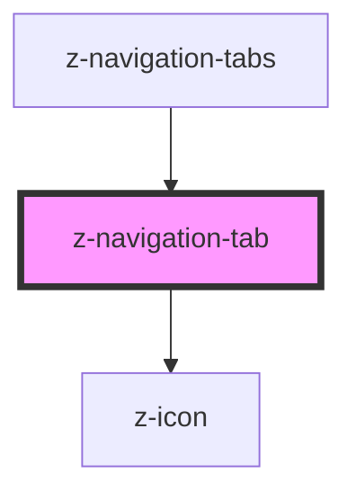

# z-navigation-tab

<!-- readme-group="pagination" -->
```html
<z-navigation-tab pageId='10' value='10'></z-navigation-tab>
<z-navigation-tab pageId='10' value='10' isdisabled></z-navigation-tab>
<z-navigation-tab pageId='10' value='10' isselected isvisited></z-navigation-tab>
```


<!-- Auto Generated Below -->


## Properties

| Property      | Attribute     | Description                                                                   | Type                                                           | Default                         |
| ------------- | ------------- | ----------------------------------------------------------------------------- | -------------------------------------------------------------- | ------------------------------- |
| `disabled`    | `disabled`    | a disabled attribute.                                                         | `boolean`                                                      | `false`                         |
| `htmlid`      | `htmlid`      | Identifier, should be unique.                                                 | `string`                                                       | `undefined`                     |
| `icon`        | `icon`        | `z-icon` name to use (optional).                                              | `string`                                                       | `undefined`                     |
| `orientation` | `orientation` | Available orientation: `horizontal` and `vertical`. Defaults to `horizontal`. | `TabOrientationEnum.horizontal \| TabOrientationEnum.vertical` | `TabOrientationEnum.horizontal` |
| `selected`    | `selected`    | a selected attribute.                                                         | `boolean`                                                      | `false`                         |
| `size`        | `size`        | Available sizes: `big` and `small`. Defaults to `big`.                        | `TabSizeEnum.big \| TabSizeEnum.small`                         | `TabSizeEnum.big`               |


## Slots

| Slot | Description |
| ---- | ----------- |
|      | tab label   |


## Dependencies

### Used by

 - [z-navigation-tabs](../z-navigation-tabs)

### Depends on

- [z-icon](../../icons/z-icon)

### Graph


----------------------------------------------

*Built with [StencilJS](https://stenciljs.com/)*
