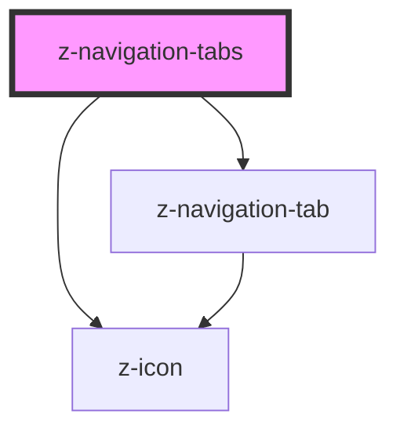

# z-navigation-tabs

<!-- Auto Generated Below -->

## Properties

| Property      | Attribute     | Description                                                                   | Type                                                           | Default                         |
| ------------- | ------------- | ----------------------------------------------------------------------------- | -------------------------------------------------------------- | ------------------------------- |
| `currenttab`  | `currenttab`  | Current displayed tab (mutable)                                               | `number`                                                       | `1`                             |
| `items`       | `items`       | Items Array prima dello slot                                                  | `string`                                                       | `undefined`                     |
| `orientation` | `orientation` | Available orientation: `horizontal` and `vertical`. Defaults to `horizontal`. | `TabOrientationEnum.horizontal \| TabOrientationEnum.vertical` | `TabOrientationEnum.horizontal` |
| `size`        | `size`        | Available sizes: `big` and `small`. Defaults to `big`.                        | `TabSizeEnum.big \| TabSizeEnum.small`                         | `TabSizeEnum.big`               |
| `starttab`    | `starttab`    | Initial starttab (mutable)                                                    | `number`                                                       | `1`                             |
| `visibletabs` | `visibletabs` | Number of visible tabs                                                        | `number`                                                       | `undefined`                     |

## Events

| Event            | Description                                   | Type               |
| ---------------- | --------------------------------------------- | ------------------ |
| `changeStartTab` | emitted on start tab change, returns starttab | `CustomEvent<any>` |
| `goToTab`        | emitted on tab number click, returns tab      | `CustomEvent<any>` |

## Dependencies

### Depends on

- [z-icon](../../icons/z-icon)
- [z-navigation-tab](../z-navigation-tab)

### Graph

----------------------------------------------

*Built with [StencilJS](https://stenciljs.com/)*
