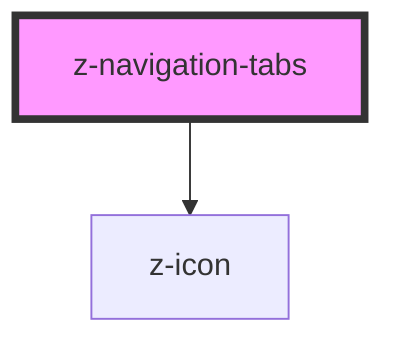

# z-navigation-tabs

<!-- Auto Generated Below -->

## Properties

| Property      | Attribute      | Description                                                                     | Type                                                                         | Default                                |
| ------------- | -------------- | ------------------------------------------------------------------------------- | ---------------------------------------------------------------------------- | -------------------------------------- |
| `ariaLabel`   | `aria-label`   | Set `aria-label` attribute to the internal `<nav>` element with `tablist` role. | `string`                                                                     | `undefined`                            |
| `orientation` | `orientation`  | Navigation tabs orientation.                                                    | `NavigationTabsOrientation.HORIZONTAL \| NavigationTabsOrientation.VERTICAL` | `NavigationTabsOrientation.HORIZONTAL` |
| `selectedTab` | `selected-tab` | Index of the selected tab.                                                      | `number`                                                                     | `undefined`                            |
| `size`        | `size`         | Navigation tabs size.                                                           | `NavigationTabsSize.BIG \| NavigationTabsSize.SMALL`                         | `NavigationTabsSize.BIG`               |

## Events

| Event      | Description                            | Type                  |
| ---------- | -------------------------------------- | --------------------- |
| `selected` | Emitted when the selected tab changes. | `CustomEvent<number>` |

## Slots

| Slot | Description                                          |
| ---- | ---------------------------------------------------- |
|      | Main slot. Use `<button>` or `<a>` tags as children. |

## Dependencies

### Depends on

- [z-icon](../../icons/z-icon)

### Graph

----------------------------------------------

*Built with [StencilJS](https://stenciljs.com/)*
