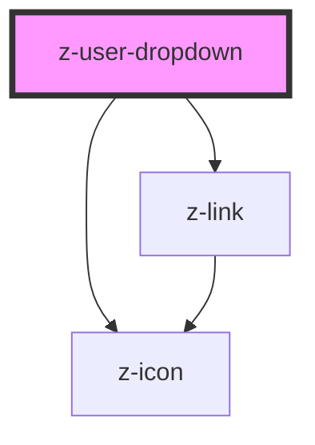

# z-user-dropdown

<!-- Auto Generated Below -->

## Properties

| Property       | Attribute      | Description                                     | Type                   | Default             |
| -------------- | -------------- | ----------------------------------------------- | ---------------------- | ------------------- |
| `logged`       | `logged`       | logged status flag                              | `boolean`              | `undefined`         |
| `menucontent`  | `menucontent`  | Json stringified or array to fill menu dropdown | `MenuItem[] \| string` | `undefined`         |
| `theme`        | `theme`        | theme variant, default 'dark'                   | `"dark" \| "light"`    | `ThemeVariant.dark` |
| `userfullname` | `userfullname` | user full name                                  | `string`               | `undefined`         |

## Dependencies

### Depends on

- [z-icon](../../icons/z-icon)
- [z-link](../z-link)

### Graph

----------------------------------------------

*Built with [StencilJS](https://stenciljs.com/)*
