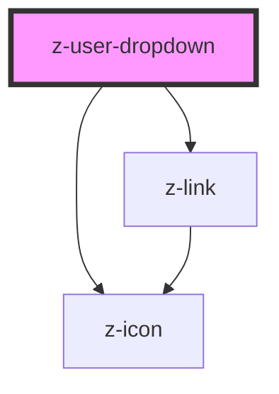

# z-user-dropdown

<!-- Auto Generated Below -->

## Properties

| Property           | Attribute            | Description                                                    | Type                   | Default     |
| ------------------ | -------------------- | -------------------------------------------------------------- | ---------------------- | ----------- |
| `logged`           | `logged`             | logged status flag                                             | `boolean`              | `undefined` |
| `menuContent`      | `menu-content`       | Json stringified or array to fill menu dropdown                | `MenuItem[] \| string` | `undefined` |
| `useInverseColors` | `use-inverse-colors` | if inner components colors are inverted, or not, default false | `boolean`              | `false`     |
| `userEmail`        | `user-email`         | user email                                                     | `string`               | `undefined` |
| `userFullName`     | `user-full-name`     | user full name                                                 | `string`               | `undefined` |

## Events

| Event                   | Description                                                      | Type               |
| ----------------------- | ---------------------------------------------------------------- | ------------------ |
| `dropdownMenuLinkClick` | Emitted on dropdown menu zlink click, returns event              | `CustomEvent<any>` |
| `userButtonClick`       | Emitted on enter or user Button click, returns isMenuOpen (bool) | `CustomEvent<any>` |

## Dependencies

### Depends on

- [z-icon](../../icons/z-icon)
- [z-link](../z-link)

### Graph

----------------------------------------------

*Built with [StencilJS](https://stenciljs.com/)*
