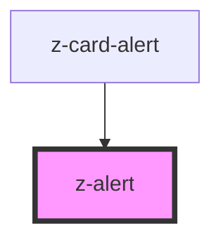

# z-alert

<!-- Auto Generated Below -->

## Properties

| Property | Attribute | Description        | Type                                                                       | Default     |
| -------- | --------- | ------------------ | -------------------------------------------------------------------------- | ----------- |
| `type`   | `type`    | alert variant type | `AlertTypesEnum.error \| AlertTypesEnum.success \| AlertTypesEnum.warning` | `undefined` |

## Slots

| Slot | Description   |
| ---- | ------------- |
|      | alert content |

## Dependencies

### Used by

 - [z-card-alert](../../card/z-card-alert)

### Graph

----------------------------------------------

*Built with [StencilJS](https://stenciljs.com/)*
