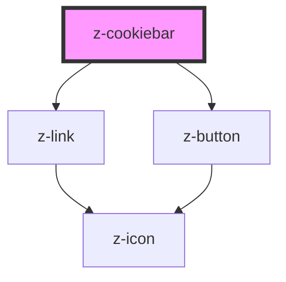

# z-cookiebar

<!-- Auto Generated Below -->

## Properties

| Property           | Attribute          | Description                                                       | Type                        | Default      |
| ------------------ | ------------------ | ----------------------------------------------------------------- | --------------------------- | ------------ |
| `cookiepolicyurl`  | `cookiepolicyurl`  | cookie policy link url                                            | `string`                    | `undefined`  |
| `hide`             | `hide`             | hide cookie bar (optional)                                        | `boolean`                   | `undefined`  |
| `preventcookieset` | `preventcookieset` | prevent default cookie set action on 'OK' button click (optional) | `boolean`                   | `undefined`  |
| `theme`            | `theme`            | theme variant (dark \| light). default: dark                      | `Theme.dark \| Theme.light` | `Theme.dark` |

## Dependencies

### Depends on

- [z-link](../../navigation/z-link)
- [z-button](../../buttons/z-button)

### Graph

----------------------------------------------

*Built with [StencilJS](https://stenciljs.com/)*
