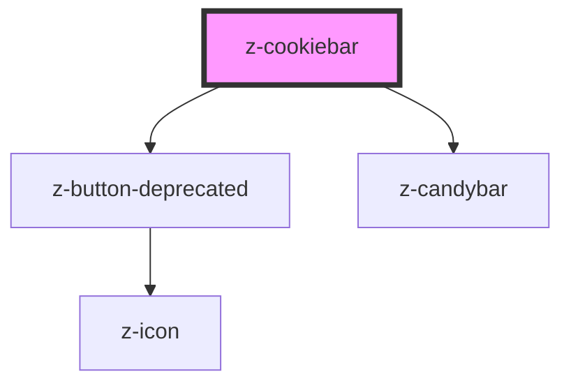

# z-cookiebar

<!-- Auto Generated Below -->

## Properties

| Property          | Attribute         | Description                                    | Type        | Default     |
| ----------------- | ----------------- | ---------------------------------------------- | ----------- | ----------- |
| `callback`        | --                | callback to handle ok button action (optional) | `() => any` | `undefined` |
| `cookiepolicyurl` | `cookiepolicyurl` | cookie policy link url                         | `string`    | `undefined` |
| `hide`            | `hide`            | hide cookie bar (optional)                     | `boolean`   | `undefined` |

## Events

| Event    | Description                                    | Type               |
| -------- | ---------------------------------------------- | ------------------ |
| `accept` | emitted on ACCETTA button click, returns event | `CustomEvent<any>` |

## Dependencies

### Depends on

- [z-button-deprecated](../../../deprecated/z-button-deprecated)
- [z-candybar](../z-candybar)

### Graph

----------------------------------------------

*Built with [StencilJS](https://stenciljs.com/)*
