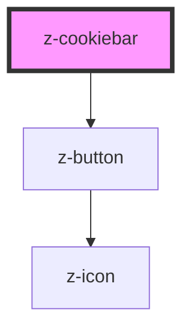

# z-cookiebar

<!-- Auto Generated Below -->

## Properties

| Property           | Attribute          | Description                                                       | Type      | Default     |
| ------------------ | ------------------ | ----------------------------------------------------------------- | --------- | ----------- |
| `bartitle`         | `bartitle`         | title cookiebar text                                              | `string`  | `undefined` |
| `cookiepolicyurl`  | `cookiepolicyurl`  | cookie policy link url                                            | `string`  | `undefined` |
| `hide`             | `hide`             | hide cookie bar (optional)                                        | `boolean` | `undefined` |
| `preventcookieset` | `preventcookieset` | prevent default cookie set action on 'OK' button click (optional) | `boolean` | `undefined` |

## Dependencies

### Depends on

- [z-button](../../buttons/z-button)

### Graph

----------------------------------------------

*Built with [StencilJS](https://stenciljs.com/)*
