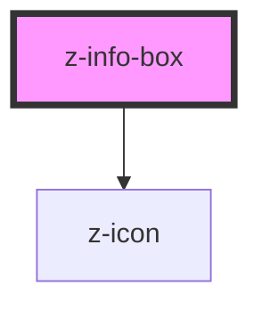

# z-info-box

<!-- readme-group="infobox" -->

```html
<z-info-box
  boxid="boxid"
  isclosable="true"
  >{content slot}</z-info-box
>
<z-info-box isclosable="false">{content slot}</z-info-box>
```

<!-- Auto Generated Below -->


## Properties

| Property     | Attribute    | Description            | Type      | Default     |
| ------------ | ------------ | ---------------------- | --------- | ----------- |
| `boxid`      | `boxid`      | info box unique id     | `string`  | `undefined` |
| `isclosable` | `isclosable` | render close icon flag | `boolean` | `true`      |


## Events

| Event          | Description                 | Type               |
| -------------- | --------------------------- | ------------------ |
| `infoBoxClose` | emitted on close icon click | `CustomEvent<any>` |


## Slots

| Slot        | Description              |
| ----------- | ------------------------ |
| `"content"` | set the info box content |


## Dependencies

### Depends on

- [z-icon](../../z-icon)

### Graph


----------------------------------------------

*Built with [StencilJS](https://stenciljs.com/)*
