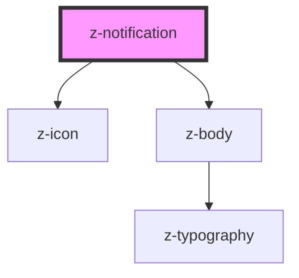

# z-notification

<!-- Auto Generated Below -->

## Properties

| Property          | Attribute         | Description                     | Type                                                                             | Default     |
| ----------------- | ----------------- | ------------------------------- | -------------------------------------------------------------------------------- | ----------- |
| `actiontext`      | `actiontext`      | action button text              | `string`                                                                         | `undefined` |
| `contenticonname` | `contenticonname` | icon on the left of the content | `string`                                                                         | `undefined` |
| `contenttext`     | `contenttext`     | content text                    | `string`                                                                         | `undefined` |
| `showclose`       | `showclose`       | enable close icon               | `boolean`                                                                        | `undefined` |
| `showshadow`      | `showshadow`      | enable shadow                   | `boolean`                                                                        | `undefined` |
| `type`            | `type`            | alert variant type              | `NotificationType.error \| NotificationType.success \| NotificationType.warning` | `undefined` |

## Events

| Event                | Description               | Type               |
| -------------------- | ------------------------- | ------------------ |
| `notificationAction` | notification action event | `CustomEvent<any>` |
| `notificationClose`  | notification close event  | `CustomEvent<any>` |

## Dependencies

### Depends on

- [z-icon](../../icons/z-icon)
- [z-body](../../typography/z-body)

### Graph

----------------------------------------------

*Built with [StencilJS](https://stenciljs.com/)*
