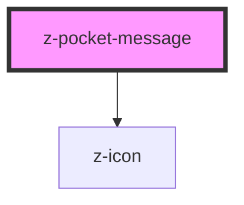

# z-pocket-message

<!-- Auto Generated Below -->

## Properties

| Property | Attribute | Description | Type     | Default     |
| -------- | --------- | ----------- | -------- | ----------- |
| `myProp` | `my-prop` |             | `string` | `undefined` |

## Slots

| Slot      | Description  |
| --------- | ------------ |
|           | message body |
| `"cta-1"` | first CTA    |
| `"cta-2"` | second CTA   |

## Dependencies

### Depends on

- [z-icon](../../icons/z-icon)

### Graph

----------------------------------------------

*Built with [StencilJS](https://stenciljs.com/)*
