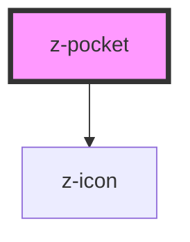

# z-pocket

<!-- Auto Generated Below -->

## Properties

| Property   | Attribute  | Description | Type      | Default     |
| ---------- | ---------- | ----------- | --------- | ----------- |
| `ismodal`  | `ismodal`  |             | `boolean` | `false`     |
| `isopen`   | `isopen`   |             | `boolean` | `true`      |
| `pocketid` | `pocketid` |             | `string`  | `undefined` |

## Methods

### `close() => Promise<void>`

close z-pocket

#### Returns

Type: `Promise<void>`

## Dependencies

### Depends on

- [z-icon](../../icons/z-icon)

### Graph

----------------------------------------------

*Built with [StencilJS](https://stenciljs.com/)*
