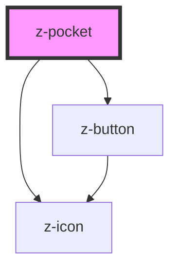

# z-pocket

<!-- Auto Generated Below -->

## Properties

| Property   | Attribute  | Description                                                                                       | Type                         | Default     |
| ---------- | ---------- | ------------------------------------------------------------------------------------------------- | ---------------------------- | ----------- |
| `ismodal`  | `ismodal`  | pocket is modal (dark background) (optional)                                                      | `boolean`                    | `false`     |
| `isopen`   | `isopen`   | pocket is open (optional)                                                                         | `boolean`                    | `true`      |
| `items`    | `items`    | array (or JSON string) of alert items (optional). If items is not defined, the slot will be used. | `PocketItemBean[] \| string` | `undefined` |
| `pocketid` | `pocketid` | pocket id                                                                                         | `string`                     | `undefined` |

## Events

| Event               | Description                                                           | Type               |
| ------------------- | --------------------------------------------------------------------- | ------------------ |
| `pocketButtonClick` | Emitted on pocket item CTA click, returns pocket id, item id          | `CustomEvent<any>` |
| `pocketToggle`      | Emitted on pocket toggle, returns pocket id and open status (boolean) | `CustomEvent<any>` |

## Methods

### `close() => Promise<void>`

close z-pocket

#### Returns

Type: `Promise<void>`

## Slots

| Slot             | Description    |
| ---------------- | -------------- |
| `"generic slot"` | pocket content |

## Dependencies

### Depends on

- [z-icon](../../icons/z-icon)
- [z-button](../../buttons/z-button)

### Graph

----------------------------------------------

*Built with [StencilJS](https://stenciljs.com/)*
