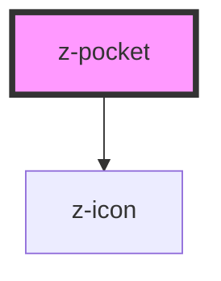

# z-pocket

<!-- Auto Generated Below -->

## Properties

| Property   | Attribute  | Description                                  | Type      | Default     |
| ---------- | ---------- | -------------------------------------------- | --------- | ----------- |
| `ismodal`  | `ismodal`  | pocket is modal (dark background) (optional) | `boolean` | `false`     |
| `isopen`   | `isopen`   | pocket is open (optional)                    | `boolean` | `true`      |
| `pocketid` | `pocketid` | pocket id                                    | `string`  | `undefined` |

## Events

| Event          | Description                                                           | Type               |
| -------------- | --------------------------------------------------------------------- | ------------------ |
| `pocketToggle` | Emitted on pocket toggle, returns pocket id and open status (boolean) | `CustomEvent<any>` |

## Methods

### `close() => Promise<void>`

close z-pocket

#### Returns

Type: `Promise<void>`

## Slots

| Slot             | Description    |
| ---------------- | -------------- |
| `"generic slot"` | pocket content |

## Dependencies

### Depends on

- [z-icon](../../icons/z-icon)

### Graph

----------------------------------------------

*Built with [StencilJS](https://stenciljs.com/)*
